# trace-args-ret.github.io
Argument and return value tracing via compiler-supported instrumentation (-fsanitize-coverage=trace-args,trace-ret)

# Function-Boundary Value Coverage for Kernel Fuzzing

Extending SanitizerCoverage and KCOV with argument and return-value observations.

# What Signal Are We Missing?

Traditional coverage tells us where execution went.

```
Input A                           Input B
   │                                │
   ▼                                ▼
 foo(x = 10)                     foo(x = 4096)
   │                                │
   └────── same control flow ───────┘
```

Control-flow coverage can tell us:

  "foo() was reached."

But sometimes we also need:

  "foo() was reached with a value that has not been observed there before."


Proposed additional signal:

  Function entry  → argument values
  Function return → returned values


# What This Is, and What It Is Not

Not full data-flow or taint tracking

We do not reconstruct how every value was produced.

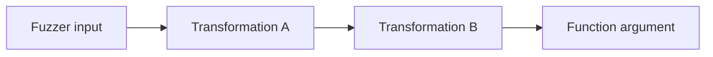

We do not attempt to answer:

1. Which input byte produced this value?
2. Which assignments and transformations contributed to it?
3. What is the complete data-dependency graph?
4. How can we use kcov-dataflow for Linux kernel fuzzing? (e.g., intergrating with syzkaller)
   I've PoC with LLVM LibFuzzer toward ksmbd but this is not the topic on today.

Function-boundary value observation

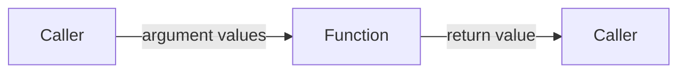

We observe which values cross function boundaries. We do not track how those values were produced.

# End-to-End Prototype

The prototype connects compiler instrumentation to two runtime consumers.


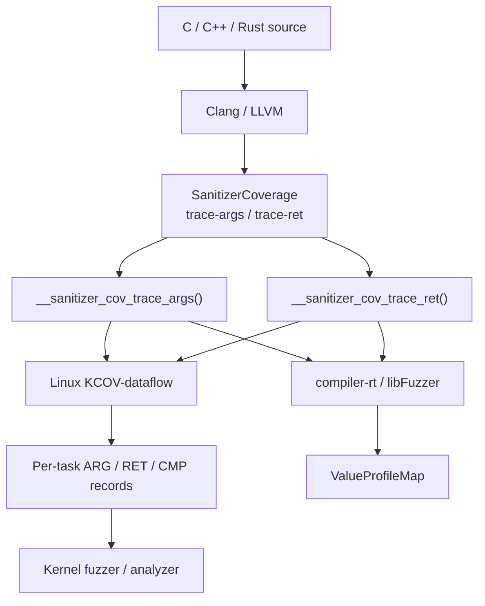


The same compiler-side observation can therefore be consumed by:

Linux kernel fuzzing
userspace fuzzing through libFuzzer
a custom runtime with strong callback definitions

The LLVM series implements the instrumentation, exposes the Clang options, adds the compiler-rt/libFuzzer runtime, and finally documents the complete interface.

# Linux Side: KCOV-Dataflow

The kernel prototype introduces a separate KCOV-dataflow facility.

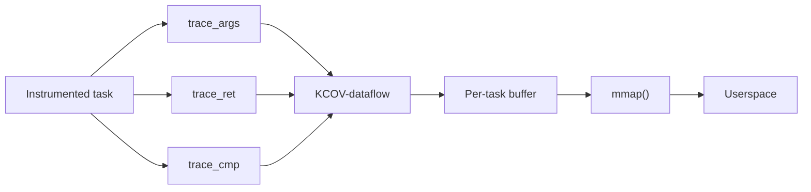

Functionality added by the kernel patches Separate KCOV-dataflow device and buffer

1. Per-task collection
2. ARG, RET, and CMP record types
3. Execution sequence numbers
4. Remote kworker and kthread collection
5. Independent coexistence with ordinary KCOV

# Per-Task, Execution-Ordered Observations

The output is not just a collection of argument values.

```
seq 100   ARG   foo arg0 = A
seq 101   ARG   foo arg1 = B
seq 102   CMP   B vs 0
seq 103   ARG   bar arg0 = B
seq 104   RET   bar = C
seq 105   RET   foo = D
```

Conceptually:

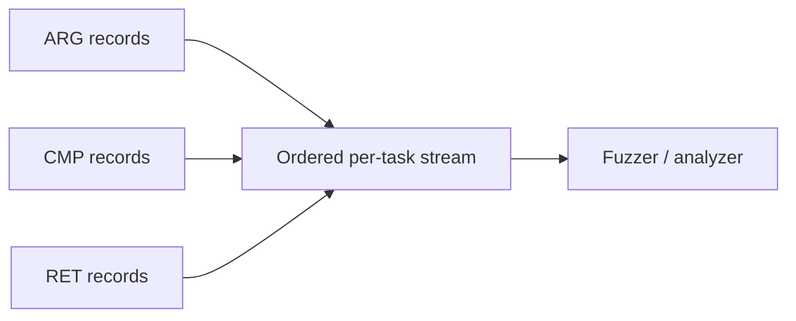

This gives a consumer more context than a global set of values:

Which function observed the value?

Was it an argument, comparison operand, or return value?

In what execution order was it observed?

# Existing KCOV Remains Independent

The prototype does not replace ordinary KCOV.

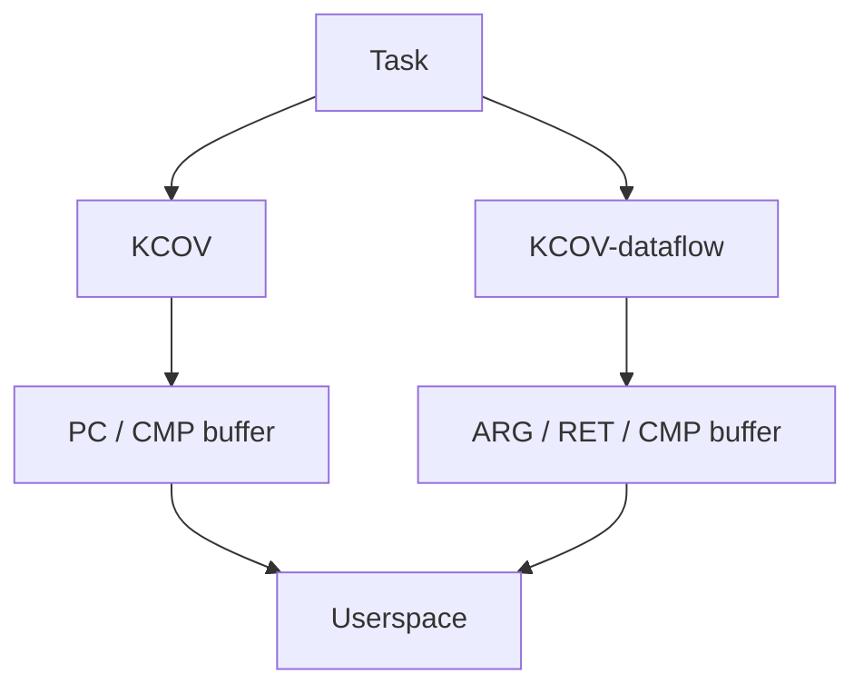

Each facility has independent:

device
file descriptor
buffer
per-task state
enable / disable lifecycle

Open kernel integration question

Should function-boundary value observation remain a separate KCOV facility, become a KCOV mode, or live in a more general tracing infrastructure?

# Structured Values Require Runtime Reads

Direct values do not require a memory access.

```
Compiler
   │
   │ val = 42
   ▼
Kernel callback
   │
   └── record 42 directly
```

Structured objects use a different representation.

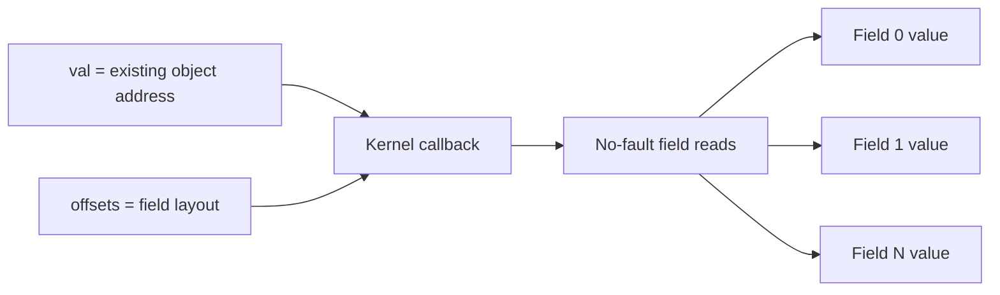

Responsibility boundary

Compiler:
    describe the available value or object layout

Runtime:
    decide whether and how the object can be read safely


Knowing an object’s type and layout does not prove that its address is safely readable.

# LLVM Series Structure

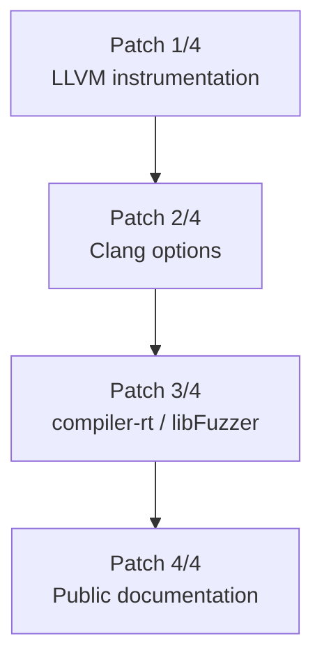

1. What values are observed? How are they represented?
2. How does a user enable the instrumentation?
3. How are the callbacks consumed in userspace?
4. What does the public interface promise?


# Two New SanitizerCoverage Modes

LLVM patch introduces:
- trace-args: In the entry block, as early as the reported values permit
- trace-ret: Before instrumentable returns
Clang exposes them through:
`-fsanitize-coverage=trace-args,trace-ret`

```
foo(a, b)
│
├── trace_args(foo, arg0, a)
├── trace_args(foo, arg1, b)
│
│   function body
│
└── trace_ret(foo, result)
```

A musttail return is not instrumented because LLVM requires the tail call and return to remain adjacent.

# Control-Flow Levels and Value Tracing Are Orthogonal

func, bb, and edge describe control-flow coverage granularity.
- func: Which function executed?
- bb: Which basic block executed?
- edge: Which control-flow transition executed?

trace-args answers a different question. Which value entered this function?

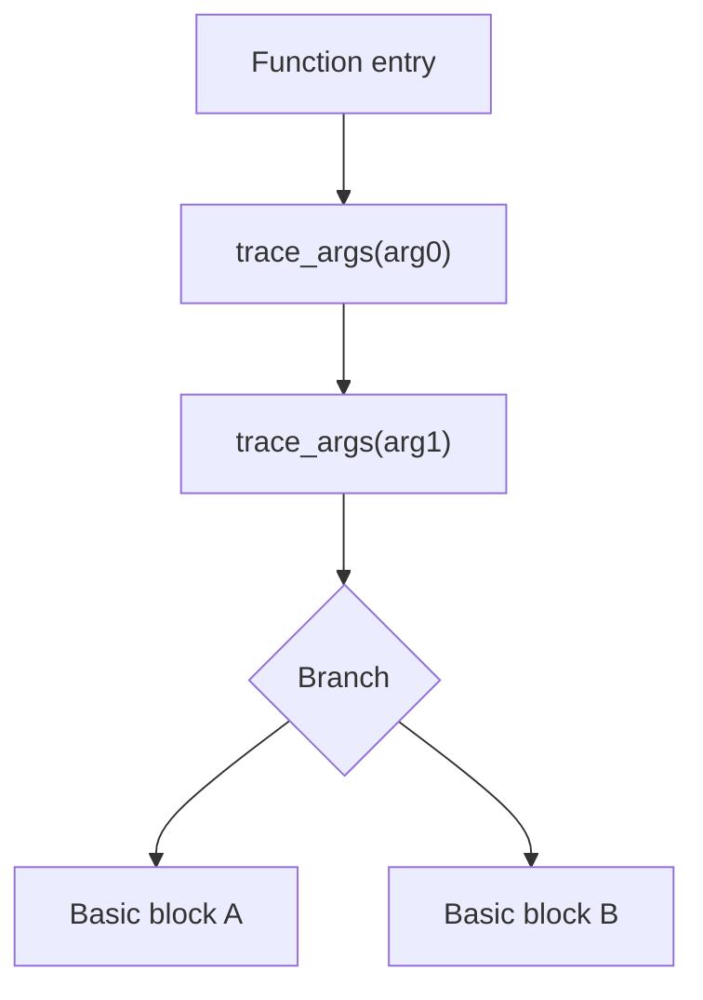

Changing func, bb, or edge does not move trace-args to those locations.

When no explicit coverage level is provided, the current Clang driver selects edge as the internal default level. This does not mean argument callbacks are inserted on every edge or that trace-pc-guard is automatically enabled.

# Why Argument Tracing Is Not Trivial

The source signature may differ from the LLVM IR signature.

Source
struct Big foo(int mode);

After ABI lowering
define void @foo(
    ptr sret(%struct.Big) %result,
    i32 %mode)

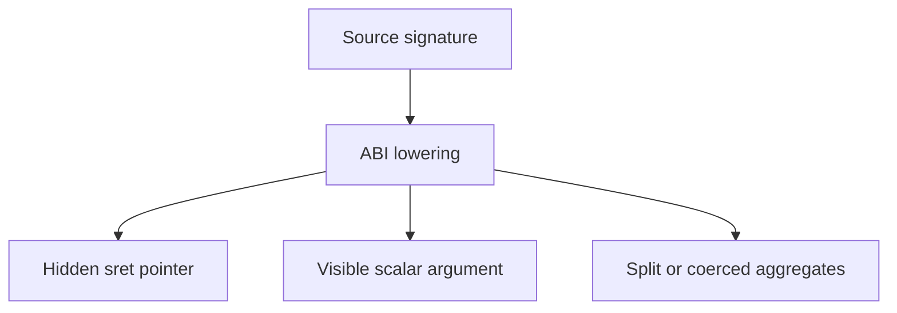

The compiler must decide whether callback identity represents:

source-level parameters
or
lowered IR / ABI arguments

The current prototype attempts to recover source-level parameter identity when usable debug records are available.

# Design Principle: Values Remain Values

Values remain values. Only objects that already exist in memory are reported by address.

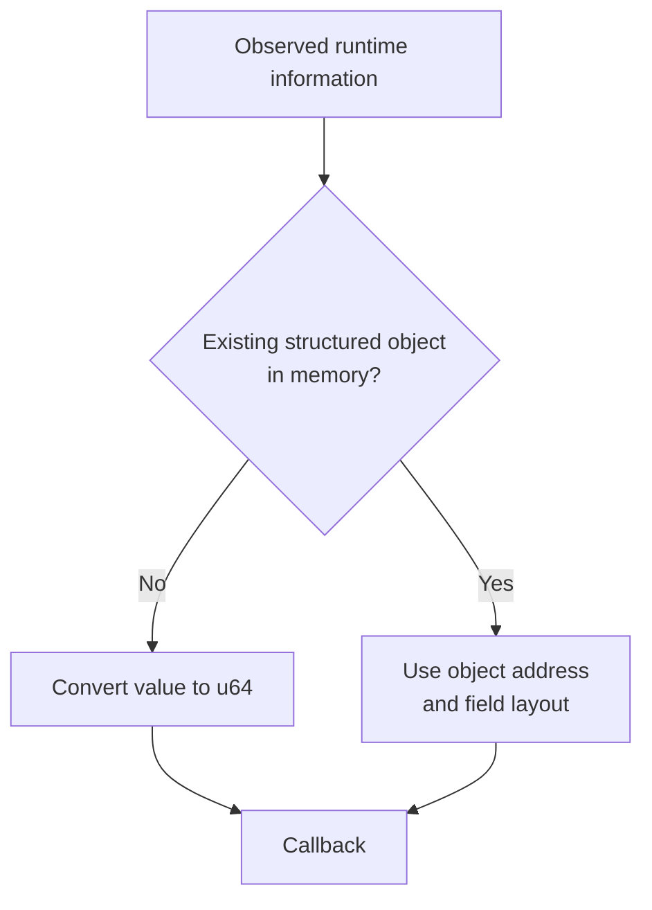

For direct values:

```
integer        → zero-extend or truncate
pointer        → ptrtoint
floating point → bit pattern
```

The pass does not introduce an alloca merely to report a value.

# Current Callback ABI

```c
void __sanitizer_cov_trace_args(
    uint64_t function_pc,
    uint32_t arg_idx,
    uint32_t size,
    uint64_t val,
    uint64_t *offsets,
    uint32_t num_fields);

void __sanitizer_cov_trace_ret(
    uint64_t function_pc,
    uint32_t size,
    uint64_t val,
    uint64_t *offsets,
    uint32_t num_fields);
```

Main interpretation rule:
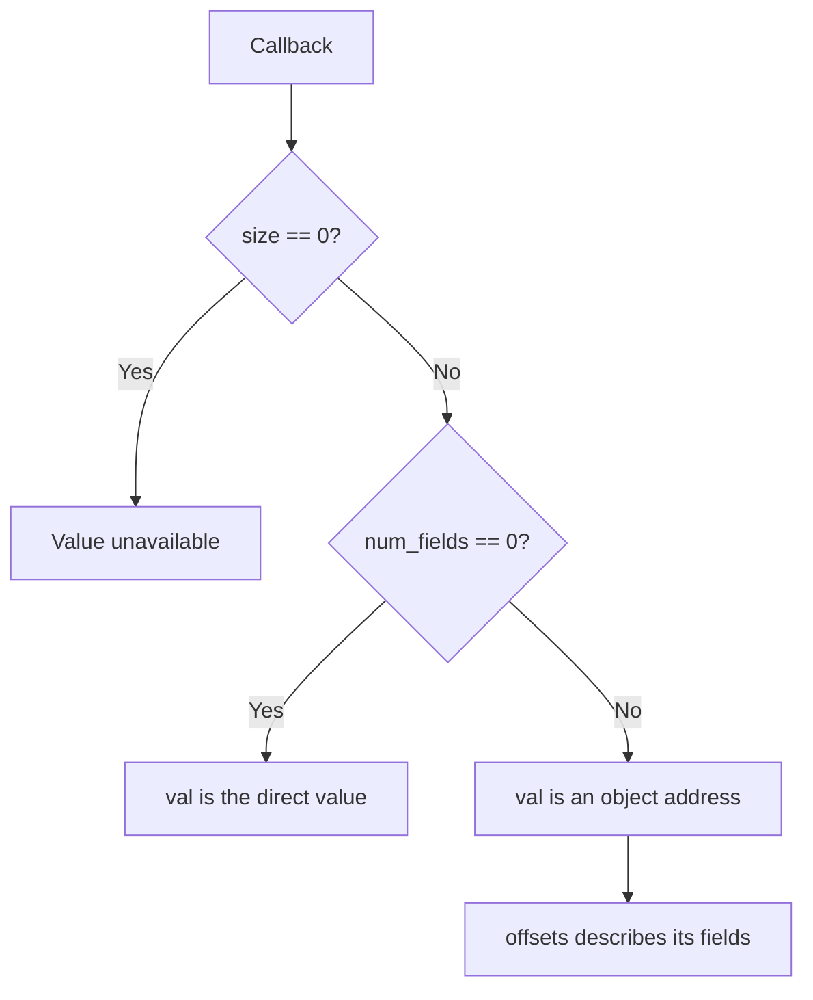

val == 0 must not be used as an unavailable marker because zero is a valid argument, return value, or null pointer.

# What Each Callback Field Means

- pc: Address of the instrumented function

  Not:
    caller PC
    call-site PC
    dynamic invocation identity

- arg_idx: Zero-based source parameter index, when recoverable

  Absent from trace-ret because a source function has one logical return value

- size: Number of meaningful bytes
  
  0 means that no value could be reported

- val

  num_fields == 0: direct value

  num_fields > 0: object address

- offsets: byte offset, byte size} pairs

- num_fields: Field count and currently also the discriminator betwee a direct value and an object address

# Structured Return Values Are Observable

trace-ret supports both major ABI return strategies.

Indirect return through sret
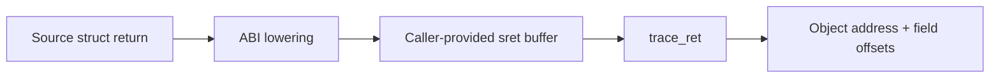

Example representation:
```
size       = sizeof(struct Big)
val        = sret buffer address
num_fields = number of fields
offsets    = struct layout
```

Register-returned aggregate
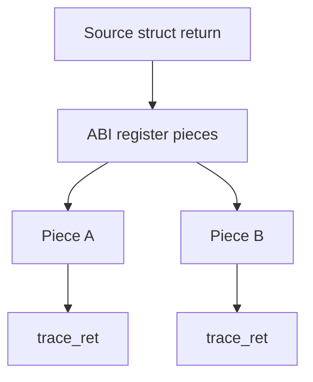

The values are observable, but the current callback does not include:

piece index
source offset
total piece count
source field identity


Structured return support and the register-piece behavior are explicitly tested in the LLVM patch.

# Debug Information Defines the Source View

Source-level argument mapping currently uses debug records.

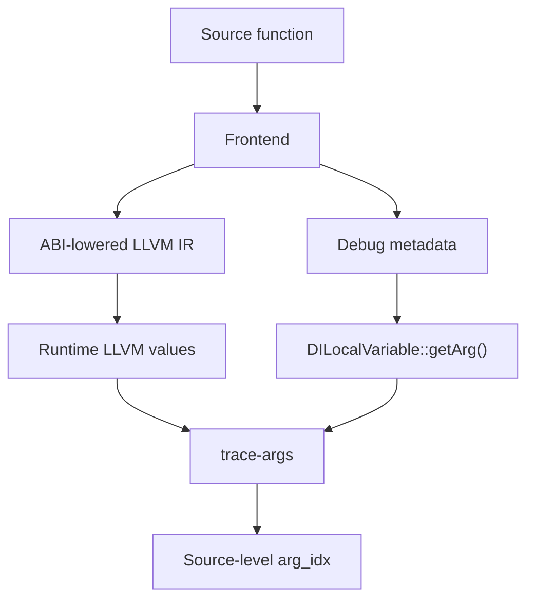

The instrumentation remains usable without -g, but its abstraction level changes.

Without debug information, trace-args/trace-ret still observe concrete LLVM IR values without manufacturing memory. Field tables generally unavailable

The no-debug fallback is generally safer than attempting incomplete source reconstruction, but its ABI-level semantics should be documented and tested explicitly.


# What We Need to Agree On

## Linux integration

1. New KCOV mode?

2. More general value-observation infrastructure?

## Compiler callback ABI

1. Abstraction level:
   Source-level parameter values? or ABI / IR-level values?
   Is usable debug metadata an acceptable input to runtime instrumentation semantics?

2. Callback representation:
   Should num_fields serve as both field count and value/address discriminator?

3. Is value width uint64_t sufficient? How should values wider than 64 bits be represented?

## Kernel mmap UAPI

1. Are 8-bit size and arg_idx fields sufficient?

2. How should structured RET values be represented?

3. Should call or return instances have explicit identifiers? 

## Runtime policy

1. Runtime memory access:
   Does type/layout metadata provide enough justification for reading an object? Who owns lifetime and fault-safety policy?

2. Linux integration: Separate KCOV-dataflow facility?

# Desired Outcome

The prototype already demonstrates an end-to-end path.

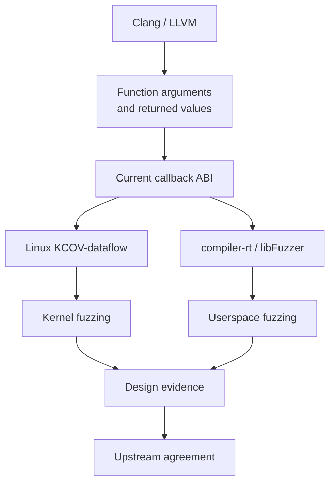

Today’s goal is to define the upstream direction before treating the prototype ABI as permanent.