# trace-args-ret.github.io
Argument and return value tracing via compiler-supported instrumentation `-fsanitize-coverage=trace-args,trace-ret`

# What Signal Are We Missing?

Traditional coverage tells us where execution went.

```
Input A                           Input B
   │                                │
   ▼                                ▼
 foo(x = 10)                     foo(x = 4096)
   │                                │
   └────── same control flow ───────┘
```

Control-flow coverage can tell us: `"foo() was reached."`

But sometimes we also need: `"foo() was reached with a value that has not been observed there before."`


Proposed additional signal:
```
  Function frame start  → argument values
  Function return       → returned values
```


# What This Is, and What It Is Not

Not full data-flow or taint tracking

We do not reconstruct how every value was produced.


We do not attempt to answer:

1. Which input byte produced this value?
2. Which assignments and transformations contributed to it?
3. What is the complete data-dependency graph?
4. How can we use kcov-dataflow for Linux kernel fuzzing?
  - e.g., intergrating with syzkaller
  - I've PoC with LLVM LibFuzzer toward ksmbd, it is very interesting.
    - [e7188199eff4](https://github.com/torvalds/linux/commit/e7188199eff4) ksmbd: fix use-after-free in __close_file_table_ids() (CVE-2026-74522 CVSS3.1 score: 8.8)
    - [7405d0ba2943](https://github.com/torvalds/linux/commit/7405d0ba2943) ksmbd: fix slab-out-of-bounds read in ksmbd_alloc_user() (CVE-2026-90174 CVSS3.1 score: 7.1)
    - [fe2c0cacbcff](https://github.com/torvalds/linux/commit/fe2c0cacbcff) smb: smbdirect: free completion queues with ib_free_cq() (CVE-2026-90173 CVSS3.1 score: 9.8)
    - [383a9480f5f4](https://github.com/torvalds/linux/commit/383a9480f5f4) smb: smbdirect: destroy QP before mem pools on accept failure (CVE-2026-90172 CVSS3.1 score: 7.5)
    - [76fa42c004eb](https://github.com/torvalds/linux/commit/76fa42c004eb) smb: smbdirect: avoid recursive listen.lock during cleanup (CVE-2026-90170)
    - [db82fbe4bb68](https://github.com/torvalds/linux/commit/db82fbe4bb68) smb: smbdirect: release pending child sockets outside the handler lock (CVE-2026-90171)
    - [e9b33376bd07](https://github.com/torvalds/linux/commit/e9b33376bd07) ksmbd: validate ipc response length before dereferencing its fields (CVE-2026-90170)
    - [b0148dc5625d](https://github.com/torvalds/linux/commit/b0148dc5625d) ksmbd: serialize oplock close with pending break ownership (CVE-2026-90167)

Function-boundary value observation


We observe which values cross function boundaries. We do not track how those values were produced.

# End-to-End Prototype

The prototype connects compiler instrumentation to two runtime consumers.


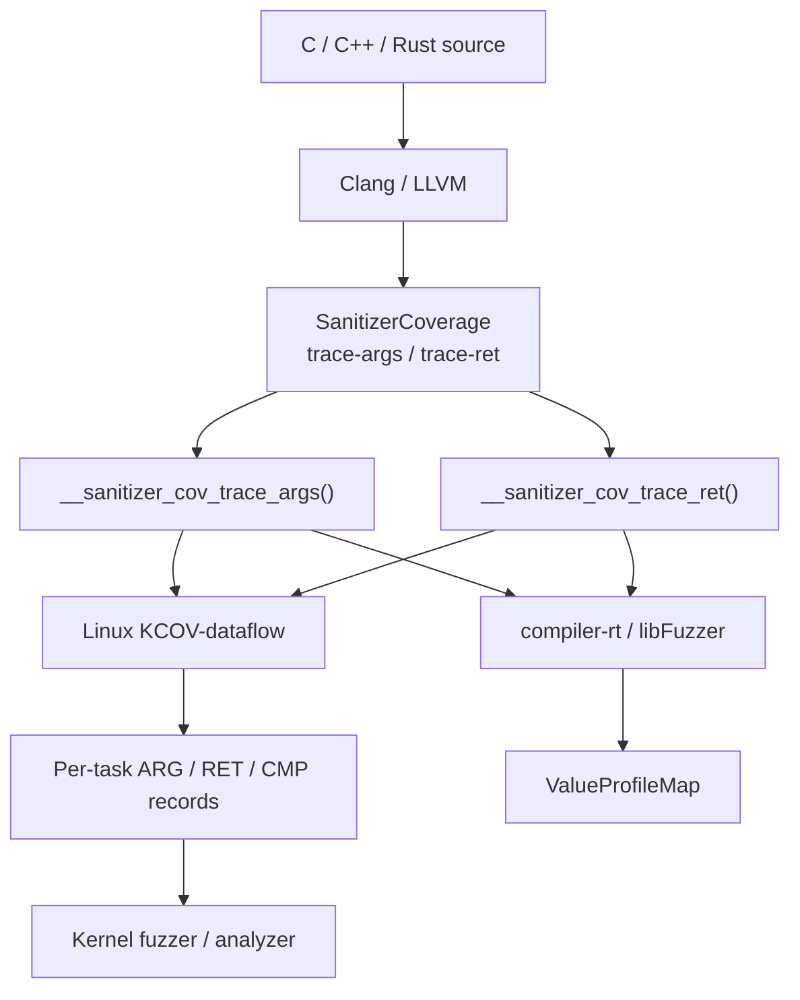


The same compiler-side observation can therefore be consumed by:
- Linux kernel fuzzing
- userspace fuzzing through libFuzzer
- a custom runtime with strong callback definitions

The LLVM series implements the instrumentation, exposes the Clang options, adds the compiler-rt/libFuzzer runtime, and finally documents the complete interface.

# Linux Side: KCOV-Dataflow

The kernel prototype introduces a separate KCOV-dataflow facility.

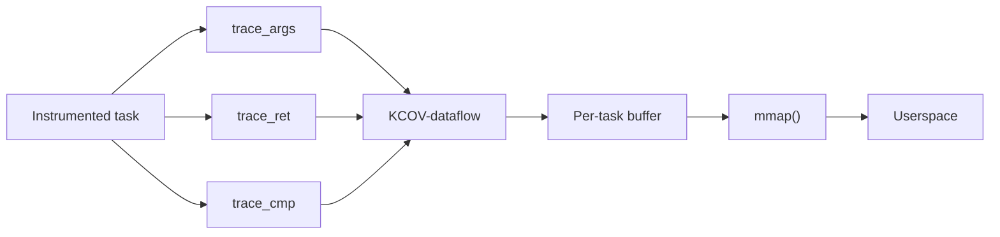

Functionality added by the kernel patches Separate KCOV-dataflow device and buffer

1. Per-task collection
2. ARG, RET, and CMP record types
3. Execution sequence numbers
4. Remote kworker and kthread collection
5. Independent coexistence with ordinary KCOV

Build integration is opt-in per object (`KCOV_DATAFLOW_file.o := y`) or per
directory (`KCOV_DATAFLOW := y`), with `CONFIG_KCOV_DATAFLOW_INSTRUMENT_ALL` as
a whole-kernel escape hatch. `CONFIG_KCOV_DATAFLOW_NO_INLINE` adds `-fno-inline`
to the explicit opt-ins only, and deliberately not to everything INSTRUMENT_ALL
covers -- that configuration does not build, and since inlined callees are
reported anyway the flag now only changes how records are attributed.

# Per-Task, Execution-Ordered Observations

The output is not just a collection of argument values.
```
seq 100   ARG   foo arg0 = A
seq 101   ARG   foo arg1 = B
seq 102   CMP   B vs 0
seq 103   ARG   bar arg0 = B
seq 104   RET   bar = C
seq 105   RET   foo = D
```

Conceptually:

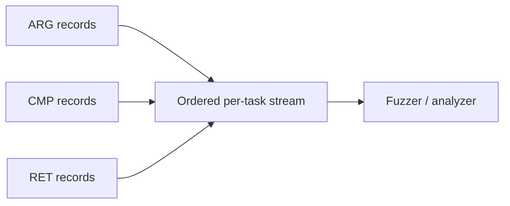

This gives a consumer more context than a global set of values:
- Which function observed the value?
- Was it an argument, comparison operand, or return value?
- In what execution order was it observed?

The record's word [1] is the call site that produced it, with the KASLR offset
removed. "Which function" therefore has two answers depending on how the
consumer resolves it: `addr2line -i` against vmlinux names the inlined callee
and the chain above it, while kallsyms names only the function whose object code
the inlined body was merged into. All three record kinds -- ARG, RET and CMP --
derive that word the same way now.

# Existing KCOV Remains Independent

The prototype does not replace ordinary KCOV.
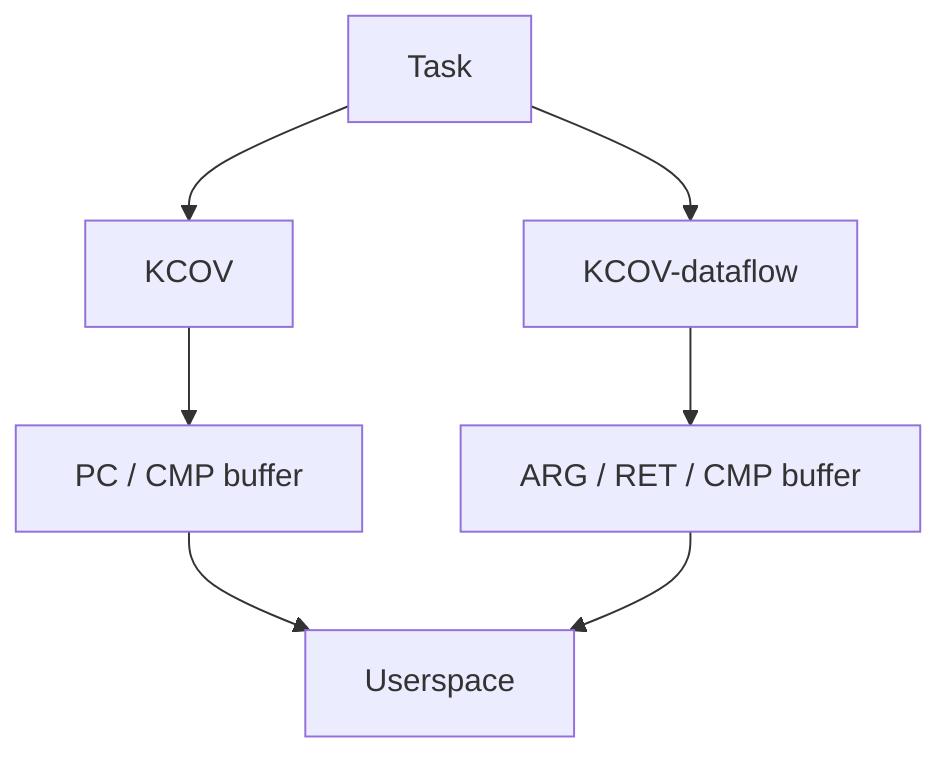

Each facility has independent:
- device
- file descriptor
- buffer
- per-task state
- enable / disable lifecycle

Open kernel integration question

Should function-boundary value observation remain a separate KCOV facility, become a KCOV mode, or live in a more general tracing infrastructure?

# Structured Values Require Runtime Reads

Direct values do not require a memory access.

```
Compiler
   │
   │ val = 42
   ▼
Kernel callback
   │
   └── record 42 directly
```

Structured objects use a different representation.

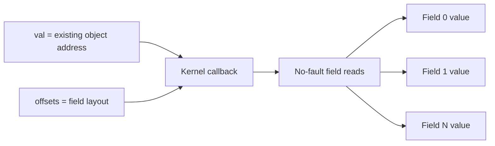

Responsibility for this feature:

- Compiler: describe the available value or object layout
- Runtime: decide whether and how the object can be read safely

Knowing an object’s type and layout does not prove that its address is safely readable.

# LLVM Series Structure

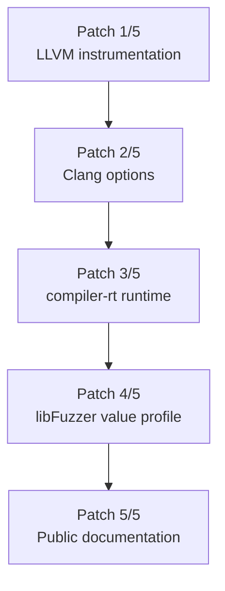

1. What values are observed? How are they represented?
2. How does a user enable the instrumentation?
3. What links when nobody consumes the callbacks?
4. How are the callbacks consumed in userspace?
5. What does the public interface promise?

Each patch adds one finished layer, so every commit is internally
ABI-consistent. An earlier six-patch version was not: patch 1 introduced an
address-based ABI with spilling and patch 2 undid it, leaving reviewers to argue
about a design the series had already abandoned.

Note on the current tree state: the frame work and the identity change are
presently folded into patch 5, the documentation commit. Before posting, the
pass changes belong in patch 1 and the signature changes in patches 3 and 4, so
that the above property holds again.


# Two New SanitizerCoverage Modes

LLVM patch introduces:
- trace-args: At the start of every frame, as early as the reported values permit
- trace-ret: Before instrumentable returns

Clang exposes them through: `-fsanitize-coverage=trace-args,trace-ret`

```
foo(a, b)
│
├── trace_args(arg0, a)
├── trace_args(arg1, b)
│
│   function body
│
└── trace_ret(result)
```

A musttail return is not instrumented because LLVM requires the tail call and return to remain adjacent.

Neither callback is told which function it speaks for. A runtime that needs to
know takes its own return address, less one so the address lies within the call
rather than on the instruction after it. This is the same convention the
existing trace-cmp callbacks use, and it is what lets the pass report inlined
callees.

# Inlined Callees Are Frames, Not Losses

The pass runs after the inliner. A callee that was inlined has no symbol, no
entry block, and often no `Function` object left at all.

An earlier version of this work treated that as a loss and discarded every
observation coming from inlined code. The answer to "then I cannot see my
callee's arguments" became `-fno-inline`, which is a bad answer:

1. It changes the code generation of the thing being measured.
2. On a whole Linux kernel it does not build. Some code relies on the inliner to
   fold a constant into an inline asm `"i"` operand:
   `arch/x86/include/asm/jump_label.h:37:11: error: invalid operand for inline asm constraint 'i'`

The compiler side should not ask the kernel to change shape so that an
instrumentation workaround keeps working.

What is left of an inlined callee is a range of instructions that debug
information still describes precisely. That is enough.

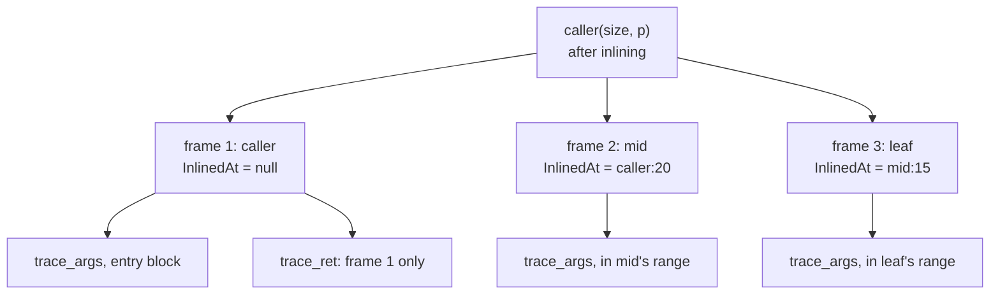

Each frame:

1. Reports its own subprogram's parameters, in its own `arg_idx` numbering
2. Traces them from inside its own instruction range
3. Carries a synthetic `DILocation` whose scope is the callee and whose
   `inlinedAt` is the call site

That last point is what makes the identity scheme work: the trace call inherits
the frame's place in the debug line table, so `addr2line -i` on the recorded
address recovers the whole chain.

```
frame 1  ra-1 -> caller:19
frame 2  ra-1 -> mid:14
                 caller:20        (inlined at)
frame 3  ra-1 -> leaf:9
                 mid:15           (inlined at)
                 caller:20        (inlined at)
```

One callee inlined at two call sites is two frames: each ran with its own
arguments.

Frames are discovered by walking the whole `inlinedAt` chain of every
instruction, not just one level. That recovers a frame whose own code the
optimizer folded away while leaving the code it had inlined behind -- a common
shape for a small wrapper. On the test case above it took the reported frame
count from one to three.

Two limits follow from running this late:

1. A frame whose code the optimizer removed entirely is not reported: there is
   no address range left to report it from.
2. Returns are reported for the surviving function only. An inlined callee has
   no `ret` instruction, and no debug record describes a return value the way
   `DILocalVariable` describes a parameter. Faking one would mean guessing.

Consequence for the kernel: `-fno-inline` is no longer needed to observe small
callees. `CONFIG_KCOV_DATAFLOW_NO_INLINE` survives as a per-object convenience
-- it makes records resolvable with plain kallsyms instead of requiring
inline-aware symbolisation -- and deliberately does not follow from
`CONFIG_KCOV_DATAFLOW_INSTRUMENT_ALL`.

Two of the eight IR tests are specifically about frames:
`trace-args-inline-frames.ll` for a frame that still has code, including the
recovered middle frame whose own code folded away, and `trace-args-inlined.ll`
for the complementary case -- a frame with no code left, which must not be
reported and whose records must not leak into the enclosing function's
parameters. Both also prove the emitted IR is well-formed, since `opt` runs the
verifier and a kernel build does not. That is the class of bug this work
actually produced: an insertion point among a block's PHI nodes, which raised no
verifier complaint in the kernel build and crashed instruction selection on
`kernel/sys.c` instead, with no useful diagnostic.

# Control-Flow Levels and Value Tracing Are Orthogonal

func, bb, and edge describe control-flow coverage granularity.
- func: Which function executed?
- bb: Which basic block executed?
- edge: Which control-flow transition executed?

trace-args answers a different question. Which values entered this frame?

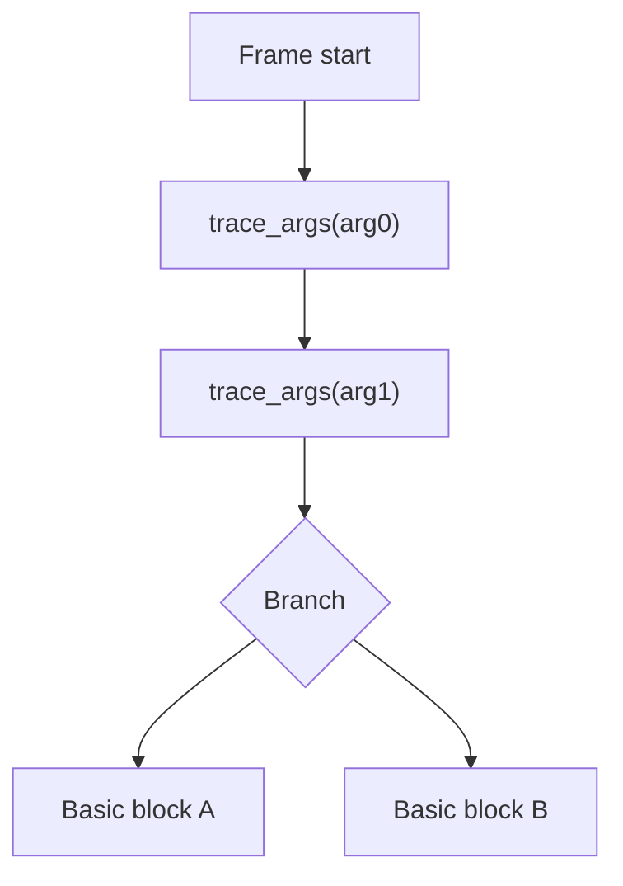

Changing func, bb, or edge does not move trace-args to those locations.

When no explicit coverage level is provided, the current Clang driver selects edge as the internal default level. This does not mean argument callbacks are inserted on every edge or that trace-pc-guard is automatically enabled.

# Why Argument Tracing Is Not Trivial

The source signature may differ from the LLVM IR signature.

`struct Big foo(int mode);`

After ABI lowering
define void @foo(
    ptr sret(%struct.Big) %result,
    i32 %mode)

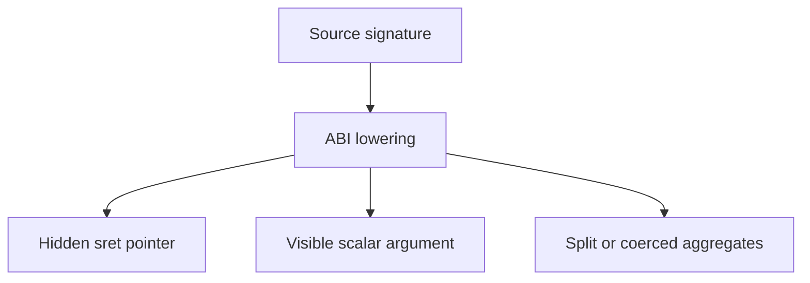

The compiler must decide whether callback identity represents:

`source-level parameters` or `lowered IR / ABI arguments`

The current prototype attempts to recover source-level parameter identity when usable debug records are available, and does so per frame -- an inlined callee's parameters are numbered in its own space, not its caller's.

# Design Principle: Values Remain Values

Values remain values. Only objects that already exist in memory are reported by address.

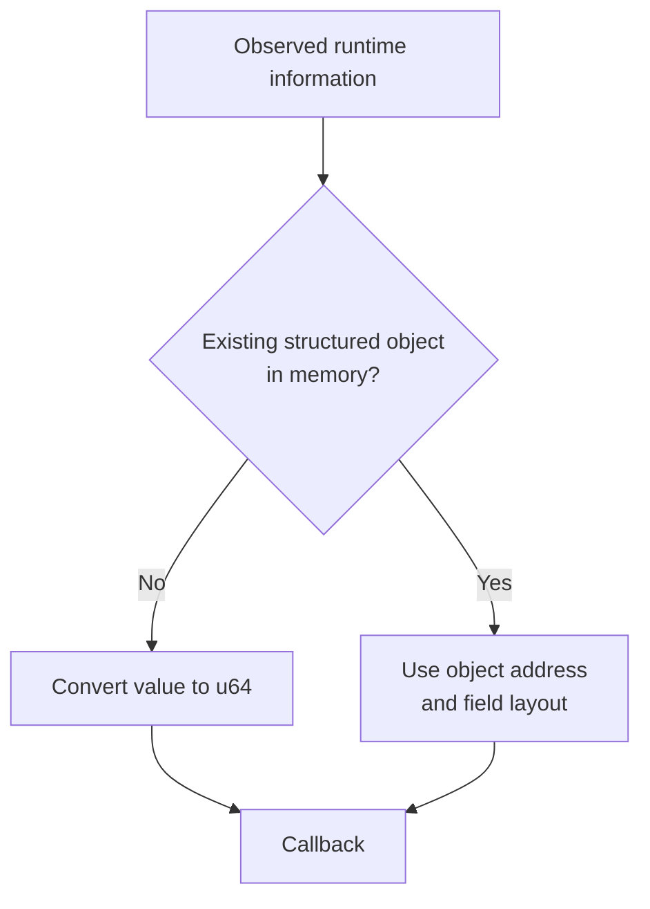

For direct values:

```
integer        → zero-extend or truncate
pointer        → ptrtoint
floating point → bit pattern
```

The pass does not introduce an alloca merely to report a value.

# Current Callback ABI

```c
void __sanitizer_cov_trace_args(
    uint32_t arg_idx,
    uint32_t size,
    uint64_t val,
    uint64_t *offsets,
    uint32_t num_fields);

void __sanitizer_cov_trace_ret(
    uint32_t size,
    uint64_t val,
    uint64_t *offsets,
    uint32_t num_fields);
```

There is no `pc` argument. An earlier version had one, carrying the address of
the instrumented function; it was removed when the pass started reporting
inlined callees, because an inlined callee has no address to put in it.
Substitutes were tried and rejected: a per-frame descriptor global would have
redefined what `pc` meant for existing consumers, and a `BlockAddress` or
`__sancov_pcs` entry per frame pins basic blocks and therefore perturbs code
generation -- defeating the reason for running after the inliner rather than
before it.

Identity is now the callback's own return address, less one:

```c
/* kernel/kcov_dataflow.c */
#define KCOV_DF_CALL_SITE(ret_ip)	((ret_ip) - 1)

/* compiler-rt/lib/fuzzer/FuzzerTracePC.cpp */
uintptr_t PC = reinterpret_cast<uintptr_t>(GET_CALLER_PC()) - 1;
```

The minus one is not tidiness. An inlined body is a bounded instruction range,
and a trace call that is the last thing in that range has a return address one
past its end, which belongs to the next frame. Without the adjustment the
record names the wrong function.

## The Same Contract, Written Out as Calls

The interpretation rule below is the form a consumer should ultimately hold in
its head. It is also the form in which two things are easy to miss: that
`arg_idx` has no counterpart on the return side at all, and that `trace_ret`
has cases of its own that the rule does not mention. So the same ground is
covered twice -- first concretely, as calls the compiler actually emits, then
as the rule. The duplication is deliberate.

```c
struct S { int a; long b; };            /* layout known: {0,4} {8,8} */

void  submit(struct S *s, int flags, void *token);  /* void return      */
struct S *lookup(struct S *tab, int id);            /* struct pointer   */
int   flags_of(struct S *s);                        /* direct scalar    */
void *opaque_of(struct S *s);                       /* opaque pointer   */
```

Four declarations covering every shape the contract has. What follows is what
`clang -O1 -g -fno-inline
-fsanitize-coverage=trace-pc-guard,trace-args,trace-ret` emits for them,
verbatim apart from elided function bodies:

```llvm
@__sancov_offsets_ = private unnamed_addr constant [4 x i64] [i64 0, i64 4, i64 8, i64 8]

define void @submit(ptr %0, i32 %1, ptr %2) {
  %4 = ptrtoint ptr %0 to i64
  call void @__sanitizer_cov_trace_args(i32 0, i32 16, i64 %4, ptr @__sancov_offsets_, i32 2)
  %5 = zext i32 %1 to i64
  call void @__sanitizer_cov_trace_args(i32 1, i32  4, i64 %5, ptr null, i32 0)
  %6 = ptrtoint ptr %2 to i64
  call void @__sanitizer_cov_trace_args(i32 2, i32  8, i64 %6, ptr null, i32 0)
  ...
  call void @__sanitizer_cov_trace_ret(i32 0, i64 0, ptr null, i32 0)
  ret void
}

; lookup, flags_of, opaque_of: the three non-void returns, one per shape
call void @__sanitizer_cov_trace_ret(i32 16, i64 %7, ptr @__sancov_offsets_, i32 2)
call void @__sanitizer_cov_trace_ret(i32  4, i64 %4, ptr null, i32 0)
call void @__sanitizer_cov_trace_ret(i32  8, i64 %6, ptr null, i32 0)
```

One table, three argument callbacks, four return callbacks, and no `alloca`
anywhere in the output.

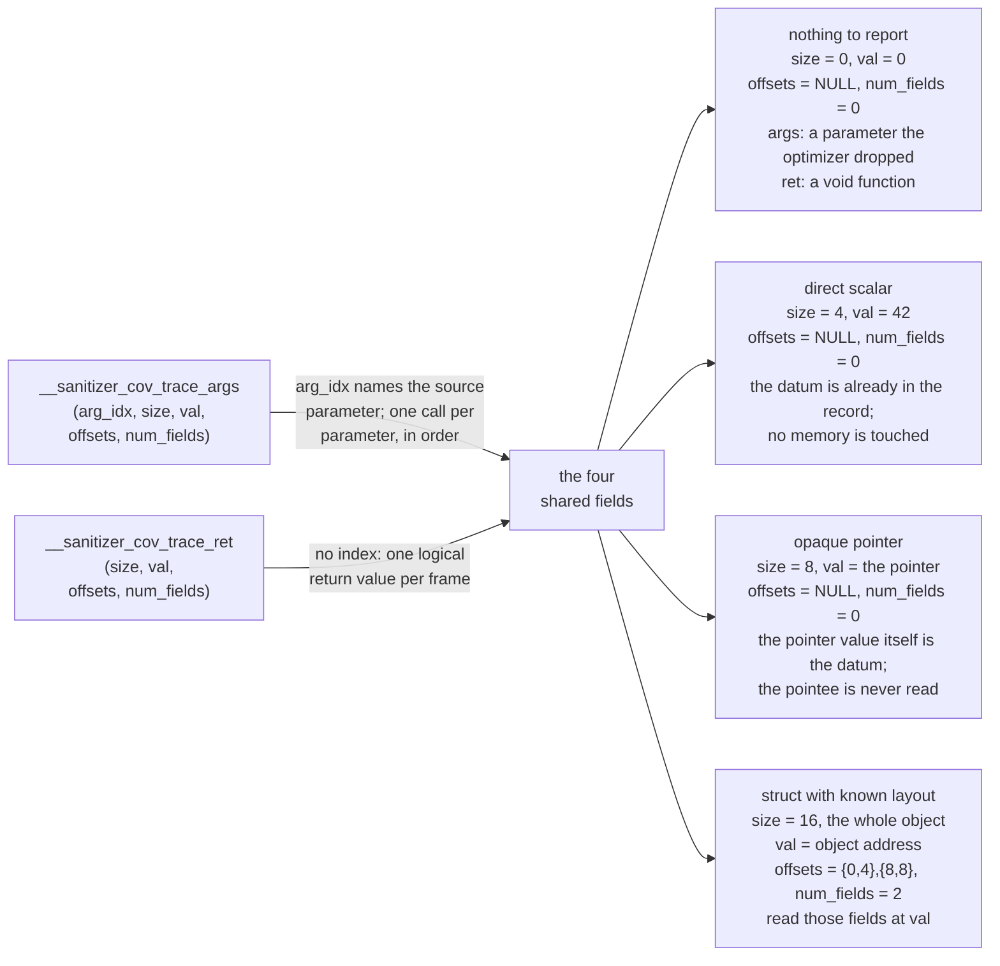

## The Four Shapes

## __sanitizer_cov_trace_args

```c
__sanitizer_cov_trace_args(
    0,                  /* arg_idx:    source parameter 0, `s`          */
    16,                 /* size:       sizeof(struct S), not of the ptr */
    (uint64_t)s,        /* val:        the object's address             */
    __sancov_offsets_,  /* offsets:    {0,4},{8,8}                      */
    2                   /* num_fields: two fields to read at val        */
);

__sanitizer_cov_trace_args(
    1,                  /* arg_idx:    source parameter 1, `flags`      */
    4,                  /* size:       sizeof(int)                      */
    42,                 /* val:        the value itself                 */
    NULL,               /* offsets:    none                             */
    0                   /* num_fields: val is the datum                 */
);

__sanitizer_cov_trace_args(
    2,                  /* arg_idx:    source parameter 2, `token`      */
    8,                  /* size:       sizeof(void *)                   */
    (uint64_t)token,    /* val:        the pointer, not the pointee     */
    NULL,               /* offsets:    no known layout to describe      */
    0                   /* num_fields: val is the datum                 */
);
```

## __sanitizer_cov_trace_ret

No value -- a `void` function, or a parameter the optimizer erased:

```c
__sanitizer_cov_trace_ret(
    0,    /* size:       no return value */
    0,    /* val:        no return value */
    NULL, /* offsets                     */
    0     /* num_fields                  */
);
```

`submit` returns nothing and the callback is emitted anyway. A consumer must
read it as *the function returned*, not as *the function returned zero*: the
discriminator is `size == 0`, never `val == 0`. The argument side produces the
same shape for a different reason -- a parameter with no debug record left is
reported with `size 0` so that the parameter list stays complete.

Direct scalar -- `flags` in `submit`, the return of `flags_of`:

```c
size       = 4             /* bytes of val that matter */
val        = 42            /* the value itself         */
offsets    = NULL
num_fields = 0
/* -> record the argument, or the return value, as 42 */
```

The instrumentation widens the value -- `zext` for an integer, `ptrtoint` for a
pointer, `bitcast` for a `double` -- and hands over the bits. No object, no
table, no memory read by anyone. This is the overwhelmingly common case.

Pointer to a struct whose layout is known -- parameter 0 of all four functions,
the return of `lookup`:

```c
size       = 16            /* sizeof(struct S), not sizeof(ptr) */
val        = &object       /* the object's address              */
offsets    = {0,4},{8,8}   /* {byte offset, byte size} pairs    */
num_fields = 2
/* -> record the fields found at that address */
```

`size` is the size of the pointee, which is the one place the contract's own
naming stops matching its contents; the pointer value appears nowhere in the
record, only the address it holds, as `val`. The table is emitted once per
struct type per module and interned, so every site referring to `struct S`
shares the one `@__sancov_offsets_` above. Reading the fields is the consumer's
job and the consumer's risk.

Opaque pointer -- `token` in `submit`, the return of `opaque_of`:

```c
size       = 8             /* sizeof(void *) */
val        = the pointer   /* not the pointee */
offsets    = NULL
num_fields = 0
/* -> record the pointer value itself */
```

Indistinguishable from a direct scalar once it is in the record, and that is
correct: with no layout to describe there is nothing to dereference, and the
instrumentation does not dereference it. Note that `size` here is the size of
the pointer -- the exact opposite of the previous case, for an argument that
looks the same in the source. That is why a consumer must branch on
`num_fields` before it interprets either field.

## What Only trace-args Has

- `arg_idx`, counting source parameters from zero in the order they were
  written. `submit` produces indices 0, 1, 2 -- one call per parameter, always,
  whatever shape the value turned out to have.

- Hidden ABI arguments do not consume an index. For `struct S f(int x)` lowered
  to `void f(ptr sret, i32 x)`, `x` is `arg_idx 0` and not 1.

- The index is per frame, not per function. After inlining, an inlined callee's
  first parameter is its own `arg_idx 0`, unrelated to the caller's.

- A struct passed by value that the ABI split across registers emits several
  calls *sharing one* `arg_idx`, because the source had one parameter.

## What Only trace-ret Has

- No index, and therefore no way to say which of several callbacks belong
  together. That matters because a function with several `ret` instructions gets
  a callback before each one: these are alternatives, not a list, and a consumer
  sees at most one of them per invocation.

- The `void` case above, which has no argument-side equivalent in meaning even
  though it has one in shape.

- A struct returned by value through a caller-provided `sret` buffer is reported
  as an object: that buffer's address, the source struct's size, its field
  table. The IR function returns `void`, so without this the return would simply
  vanish.

- A struct small enough to come back in registers has no address, so it is
  reported as one direct-scalar callback per register piece. With no `arg_idx`
  to share and no piece index in the signature, those calls are observable but
  not reassemblable.

- A `musttail` call must stay adjacent to the `ret` that forwards it, so there
  is nowhere to put the callback and none is emitted. The return is silently
  unobserved -- the one case where a consumer cannot tell the difference between
  a function that was not instrumented and one that was.

## Main Interpretation Rule

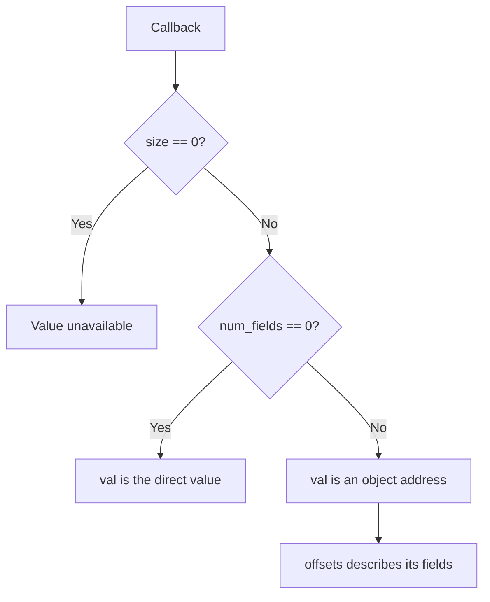

val == 0 must not be used as an unavailable marker because zero is a valid argument, return value, or null pointer.

# What Each Callback Field Means

- arg_idx: Zero-based source parameter index, when recoverable
  Numbered within the frame it belongs to, so an inlined callee's parameter 0 is
  its own and not its caller's
  Absent from trace-ret because a source function has one logical return value

- size: Number of meaningful bytes
  0 means that no value could be reported

- val

  num_fields == 0: direct value
  num_fields > 0: object address

- offsets: {byte offset, byte size} pairs

- num_fields: Field count and currently also the discriminator between a direct value and an object address

Not a field, but part of the contract:

- the recorded location: the callback's own return address, less one

  Resolved with inline information (`addr2line -i`) it names the inlined callee
  that reported the value and the chain it was inlined through

  Resolved with a plain symbol table it names only the function the code was
  merged into -- a real loss of resolution, and the one cost the identity change
  pushes onto consumers

  It is still not a dynamic invocation identity: two recursive calls remain
  indistinguishable

# Structured Return Values Are Observable

trace-ret supports both major ABI return strategies.

Indirect return through sret


Example representation:
```
size       = sizeof(struct Big)
val        = sret buffer address
num_fields = number of fields
offsets    = struct layout
```

Register-returned aggregate
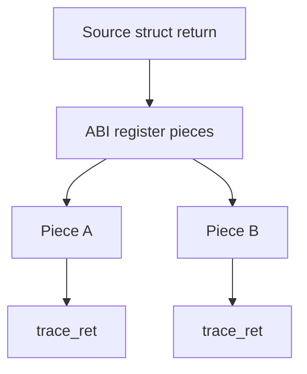

The values are observable, but the current callback does not include:

- piece index
- source offset
- total piece count
- source field identity


Structured return support and the register-piece behavior are explicitly tested in the LLVM patch.

# Debug Information Defines the Source View

Source-level argument mapping currently uses debug records, and the two modes
ask debug metadata for different things.

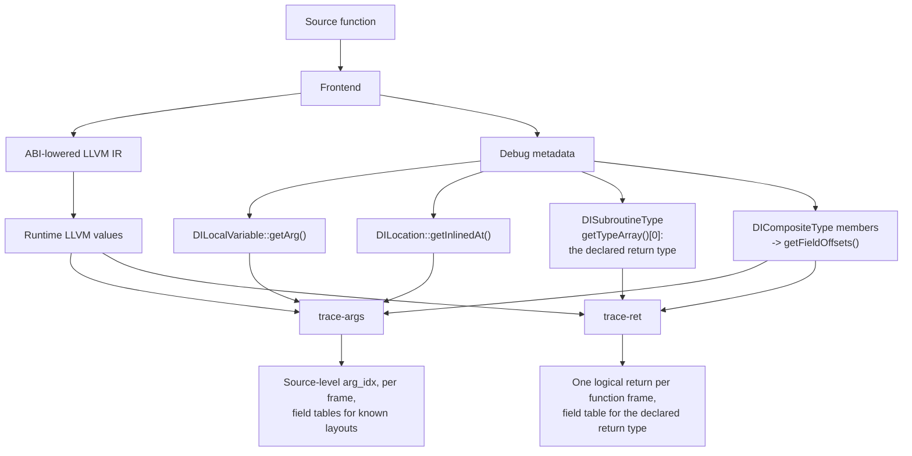

trace-args makes three debug queries: `DILocalVariable::getArg()` for the index,
`DILocation::getInlinedAt()` to discover that an inlined callee is there to
report at all, and the member list of a `DICompositeType` for a field table.

trace-ret makes exactly one, `getDeclaredReturnType()`:

```cpp
static DIType *getDeclaredReturnType(DISubprogram *SP) {
  if (!SP || !SP->getType() || SP->getType()->getTypeArray().empty())
    return nullptr;
  return SP->getType()->getTypeArray()[0];
}
```

It needs no `DILocalVariable`, because there is no index to recover, and it
deliberately asks nothing about inlining. The declared return type then feeds
the same `getFieldOffsets()` the argument side uses, which is why one
`@__sancov_offsets_` table serves both modes for a given struct.

What trace-ret does not get from debug metadata is frames:

```c
/* InjectTraceForRet() */
// Only F's own frame is reported here. A callee the inliner merged into F has
// no return instruction left - its result became an ordinary value of F - and
// no debug record describes a return value the way DILocalVariable describes a
// parameter, so there is nothing to key an inlined return on. Arguments of
// inlined frames are still reported; see collectInlineFrames().
```

So richer debug information widens what trace-args sees and does not widen what
trace-ret sees. Inlining a callee adds argument records and adds no return
record.

The instrumentation remains usable without -g, but its abstraction level changes.

Without debug information, trace-args/trace-ret still observe concrete LLVM IR values without manufacturing memory. Field tables generally unavailable

A build without -g also has no debug locations, so it discovers no inlined
frames: one frame, the function's own body, reported positionally from its IR
argument list. This is not a special case bolted on; it falls out of the same
loop, which is why the no-debug behaviour did not change when frames were added.

On the return side the loss is uneven, and one case is worse than anything on
the argument side. With no declared return type there is no field table, and for
an indirect return there is also no size, so the value is not reported at all:

```llvm
; opt -passes='module(sancov-module)' -sanitizer-coverage-level=3
;     -sanitizer-coverage-trace-ret, on IR carrying no !dbg at all

define i32 @ret_scalar_no_debug(i32 %x)
  ; unchanged
  call void @__sanitizer_cov_trace_ret(i32 4, i64 %0, ptr null, i32 0)

define ptr @ret_ptr_no_debug(ptr %s)
  ; the pointer, not the object it points at
  call void @__sanitizer_cov_trace_ret(i32 8, i64 %0, ptr null, i32 0)

define void @ret_sret_no_debug(ptr sret(%struct.Big) %0)
  ; dropped: size 0, indistinguishable from a void function
  call void @__sanitizer_cov_trace_ret(i32 0, i64 0, ptr null, i32 0)
```

A scalar return is unaffected. A pointer return degrades the same way a pointer
argument does, to the pointer's own value. An indirect struct return becomes
`size == 0` -- indistinguishable from a `void` function -- because the buffer is
a struct in memory rather than a value that fits in a register, and without the
declared type there is nothing to say how much of it to read. The argument side
has no equivalent: it still reports every parameter the IR declares, positionally.

The no-debug fallback is generally safer than attempting incomplete source reconstruction, but its ABI-level semantics should be documented and tested explicitly.

That is not yet true of the return side. `trace-args-no-debug.ll` pins the
argument behaviour; there is no corresponding test for trace-ret, so the
dropped-sret case above is current behaviour rather than agreed behaviour.

The frame work raises the stakes here rather than changing the answer. Debug
metadata is now not only how arg_idx is derived but how an inlined callee is
discovered at all, so the set of functions a build observes depends on how well
debug locations survived optimisation. The counter-argument is that the
information is not available anywhere else: after the inliner, debug metadata is
the only record that the callee ever existed.


# What We Need to Agree On

## Linux integration

1. New KCOV mode? Separate KCOV-dataflow facility?

2. More general value-observation infrastructure?

## Compiler callback ABI

1. Abstraction level:
   Source-level parameter values? or ABI / IR-level values?
   Is usable debug metadata an acceptable input to runtime instrumentation semantics?
   It now decides not only arg_idx but which functions are observed at all.

2. Callback representation:
   Should num_fields serve as both field count and value/address discriminator?

3. Is value width uint64_t sufficient? How should values wider than 64 bits be represented?

4. Identity:
   Is a return address the right identity for an instrumentation callback?
   It is what makes inlined frames reportable and it matches trace-cmp, but it
   requires the consumer to resolve an address -- and to resolve it *well*
   requires inline-aware symbolisation. May an ABI assume that of its consumers?

## Kernel mmap UAPI

1. Are 8-bit size and arg_idx fields sufficient?

2. How should structured RET values be represented?

3. Should call or return instances have explicit identifiers?

4. Loss reporting: there is no dropped-record counter. A full buffer is
   indistinguishable from a short capture. Reporting inlined frames multiplies
   the record rate, so this stopped being theoretical: a selftest trigger filled
   a 1M-word buffer and the missing tail surfaced as four failed assertions
   rather than as a diagnostic, and the binderfs selftest currently *passes*
   while running three words short of filling its own buffer.

## Runtime policy

1. Runtime memory access:
   Does type/layout metadata provide enough justification for reading an object? Who owns lifetime and fault-safety policy?

# Desired Outcome

The prototype already demonstrates an end-to-end path.

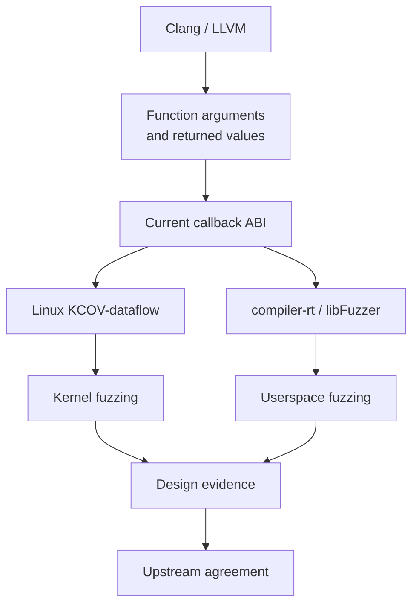

Today’s goal is to define the upstream direction before treating the prototype ABI as permanent.