# trace-args-ret.github.io

컴파일러가 지원하는 계측 옵션 -fsanitize-coverage=trace-args,trace-ret을 이용한 함수 인자 및 반환값 추적

# 우리에게 부족한 시그널은 무엇인가?

기존의 커버리지는 실행이 어디로 진행되었는지를 알려준다.

```
입력 A                           입력 B
   │                                │
   ▼                                ▼
 foo(x = 10)                     foo(x = 4096)
   │                                │
   └──────── 동일한 제어 흐름 ────────┘
```

제어 흐름 커버리지는 다음과 같은 사실을 알려줄 수 있다: `"foo()가 실행되었다."`

하지만 때로는 다음 정보도 필요하다: `"foo()가 이 위치에서 이전에 관측되지 않았던 값과 함께 실행되었다."`


제안하는 추가 시그널:
```
  함수 프레임 시작  → 인자 값
  함수 반환        → 반환값
```


# 이것은 무엇이며, 무엇이 아닌가?

완전한 데이터 흐름 추적이나 테인트 추적이 아니다.

각 값이 어떤 과정을 거쳐 생성되었는지를 재구성하지 않는다.


다음 질문에 답하려는 것이 아니다.

1. 어떤 입력 바이트가 이 값을 만들었는가?
2. 어떤 대입과 변환이 이 값에 기여했는가?
3. 전체 데이터 의존성 그래프는 무엇인가?
4. Linux 커널 퍼징에 kcov-dataflow를 어떻게 사용할 수 있는가?
   - 예: syzkaller와의 통합
   - ksmbd를 대상으로 LLVM LibFuzzer를 사용한 fuzzer 의 PoC를 가지고 있으며, 매우 흥미로운 결과를 얻었다.
		- [CVE-2026-74522](https://www.cve.org/CVERecord/?id=CVE-2026-74522) (CVSS3.1 score: 8.8): [e7188199eff4](https://github.com/torvalds/linux/commit/e7188199eff4) ksmbd: fix use-after-free in __close_file_table_ids()
		- [CVE-2026-90174](https://www.cve.org/CVERecord/?id=CVE-2026-90174) (CVSS3.1 score: 7.1): [7405d0ba2943](https://github.com/torvalds/linux/commit/7405d0ba2943) ksmbd: fix slab-out-of-bounds read in ksmbd_alloc_user()
		- [CVE-2026-90173](https://www.cve.org/CVERecord/?id=CVE-2026-90173) (CVSS3.1 score: 9.8): [fe2c0cacbcff](https://github.com/torvalds/linux/commit/fe2c0cacbcff) smb: smbdirect: free completion queues with ib_free_cq()
		- [CVE-2026-90172](https://www.cve.org/CVERecord/?id=CVE-2026-90172) (CVSS3.1 score: 7.5): [383a9480f5f4](https://github.com/torvalds/linux/commit/383a9480f5f4) smb: smbdirect: destroy QP before mem pools on accept failure
		- [CVE-2026-90171](https://www.cve.org/CVERecord/?id=CVE-2026-90171): [db82fbe4bb68](https://github.com/torvalds/linux/commit/db82fbe4bb68) smb: smbdirect: release pending child sockets outside the handler lock
		- [CVE-2026-90170](https://www.cve.org/CVERecord/?id=CVE-2026-90170): [e9b33376bd07](https://github.com/torvalds/linux/commit/e9b33376bd07) ksmbd: validate ipc response length before dereferencing its fields
		- [CVE-2026-90167](https://www.cve.org/CVERecord/?id=CVE-2026-90167): [b0148dc5625d](https://github.com/torvalds/linux/commit/b0148dc5625d) ksmbd: serialize oplock close with pending break ownership
		- [76fa42c004eb](https://github.com/torvalds/linux/commit/76fa42c004eb) smb: smbdirect: avoid recursive listen.lock during cleanup

함수 경계에서의 값 관측


우리는 어떤 값이 함수 경계를 통과하는지를 관측한다. 그 값이 어떻게 생성되었는지는 추적하지 않는다.


# End-to-End 프로토타입

이 프로토타입은 컴파일러 계측을 두 종류의 런타임 consumer와 연결한다.


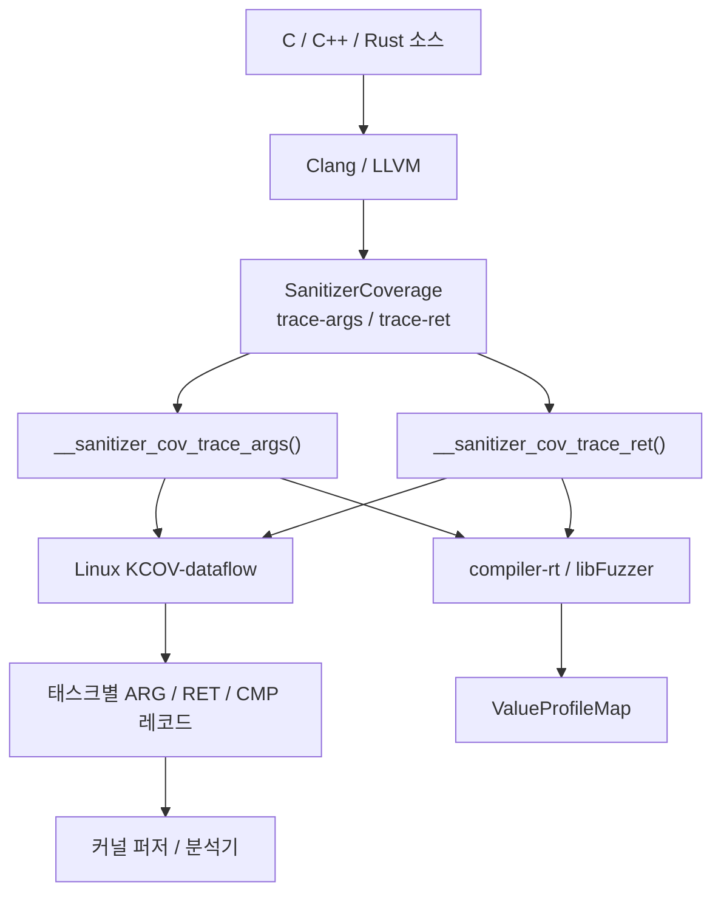


따라서 컴파일러 측에서 이루어지는 동일한 관측을 다음과 같은 consumer가 사용할 수 있다.
- Linux 커널 퍼징
- libFuzzer를 이용한 사용자 공간 퍼징
- strong callback 정의를 제공하는 커스텀 런타임

LLVM 패치 시리즈는 계측을 구현하고, Clang 옵션을 노출하며, compiler-rt/libFuzzer 런타임을 추가한 뒤, 마지막으로 전체 인터페이스를 문서화한다.

# Linux 측: KCOV-Dataflow

커널 프로토타입은 별도의 KCOV-dataflow 기능을 도입한다.

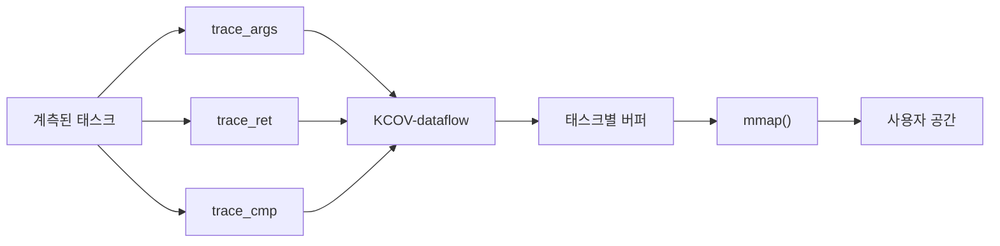

커널 패치가 추가하는 기능:

1. 별도의 KCOV-dataflow 디바이스와 버퍼
2. 태스크별 데이터 수집
3. ARG, RET, CMP 레코드 타입
4. 실행 순서 번호
5. 원격 kworker 및 kthread 데이터 수집
6. 기존 KCOV와의 독립적인 공존

이 기능을 사용하기 위한 빌드는 오브젝트별로 KCOV_DATAFLOW_file.o := y를 지정하거나, 디렉터리별로 KCOV_DATAFLOW := y를 지정하는 opt-in 방식이다. 전체 커널을 대상으로 사용할 수 있는 탈출구로 CONFIG_KCOV_DATAFLOW_INSTRUMENT_ALL도 제공한다.

CONFIG_KCOV_DATAFLOW_NO_INLINE은 명시적으로 opt-in한 대상에만 -fno-inline을 추가하며, INSTRUMENT_ALL이 포함하는 모든 대상에는 의도적으로 적용하지 않는다. 해당 구성으로는 빌드할 수 없기 때문이다. 또한 이제 인라인된 피호출 함수도 보고되므로, 이 플래그는 레코드가 어느 함수에 귀속되는지만 변경한다.

# 태스크별, 실행 순서 기반 관측

출력은 단순한 인자 값의 집합이 아니다.
```
seq 100   ARG   foo arg0 = A
seq 101   ARG   foo arg1 = B
seq 102   CMP   B vs 0
seq 103   ARG   bar arg0 = B
seq 104   RET   bar = C
seq 105   RET   foo = D
```

개념적으로는 다음과 같다.

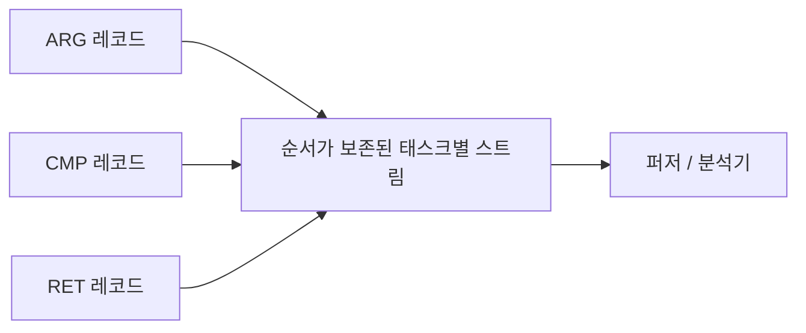

이 방식은 단순한 전역 값 집합보다 더 많은 문맥을 소비자에게 제공한다.
- 어느 함수가 이 값을 관측했는가?
- 인자, 비교 피연산자, 반환값 중 무엇이었는가?
- 어떤 실행 순서로 관측되었는가?

레코드의 word [1]은 레코드를 생성한 호출 지점에서 KASLR 오프셋을 제거한 값이다.
따라서 “어느 함수인가?”라는 질문에는 소비자가 주소를 어떻게 해석하느냐에 따라 두 가지 답이 존재한다.
vmlinux에 대해 addr2line -i를 사용하면 인라인된 피호출 함수와 그 위의 전체 인라인 체인을 확인할 수 있다.
kallsyms는 인라인된 코드가 병합된 실제 오브젝트 코드를 소유한 함수만 보여준다.
현재는 ARG, RET, CMP 세 종류의 레코드가 모두 동일한 방식으로 이 word를 계산한다.

# 기존 KCOV는 독립적으로 유지된다

이 프로토타입은 기존 KCOV를 대체하지 않는다.

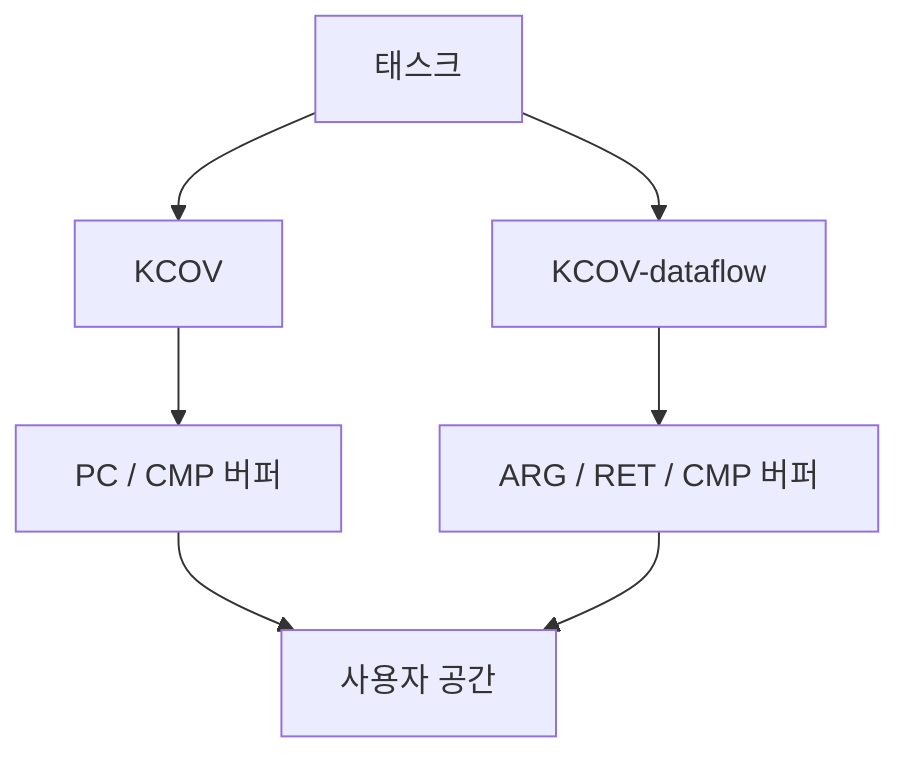

두 기능은 각각 다음 항목을 독립적으로 가진다.
- 디바이스
- 파일 디스크립터
- 버퍼
- 태스크별 상태
- enable/disable 생명주기

커널 통합과 관련된 열린 질문:

함수 경계에서의 값 관측을 별도의 KCOV 기능으로 유지해야 하는가, KCOV의 새로운 모드로 만들어야 하는가, 아니면 더 일반적인 트레이싱 인프라에 포함해야 하는가?

# 구조화된 값에는 런타임 메모리 읽기가 필요하다

직접 값은 메모리 접근을 필요로 하지 않는다.

```
컴파일러
   │
   │ val = 42
   ▼
커널 콜백
   │
   └── 42를 직접 기록
```

구조화된 객체는 다른 표현 방식을 사용한다.

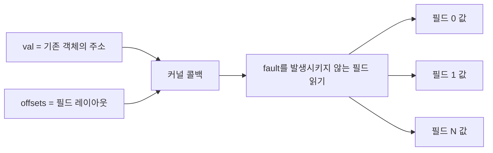

이 기능에 대한 역할 분담:

- 컴파일러: 사용 가능한 값 또는 객체의 레이아웃을 기술한다.
- 런타임: 객체를 안전하게 읽을 수 있는지, 그리고 어떻게 읽을지를 결정한다.

객체의 타입과 레이아웃을 안다는 사실만으로 해당 주소가 안전하게 읽을 수 있는 주소라고 보장할 수는 없다.

# LLVM 패치 시리즈 구조

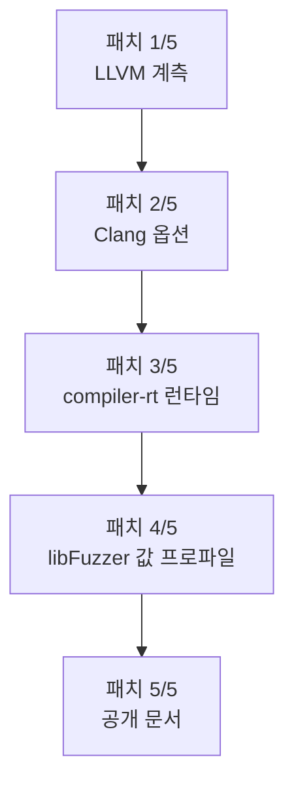

1. 어떤 값을 관측하는가? 그 값은 어떻게 표현되는가?
2. 사용자는 계측을 어떻게 활성화하는가?
3. 콜백을 소비하는 런타임이 없을 때도 무엇이 링크되는가?
4. 사용자 공간에서는 콜백을 어떻게 소비하는가?
5. 공개 인터페이스는 무엇을 보장하는가?

각 패치는 하나의 완성된 계층을 추가하므로, 모든 커밋이 내부적으로 ABI 일관성을 유지한다.

이전의 6개 패치 버전은 그렇지 않았다. 패치 1에서 spilling을 사용하는 주소 기반 ABI를 도입한 뒤, 패치 2에서 이를 되돌렸다. 그 결과 리뷰어들은 패치 시리즈가 이미 포기한 설계를 놓고 논쟁해야 했다.


현재 트리 상태에 대한 참고 사항:

프레임 처리와 identity 변경이 현재 패치 5인 문서화 커밋에 포함되어 있다. 패치를 게시하기 전에 pass 변경은 패치 1로, 함수 시그니처 변경은 패치 3과 패치 4로 옮겨야 한다. 그래야 위의 ABI 일관성 원칙이 다시 성립한다.

# 두 개의 새로운 SanitizerCoverage 모드

LLVM 패치는 다음 모드를 도입한다.

- trace-args: 각 프레임이 시작될 때, 보고 가능한 값이 허용하는 한 가장 이른 위치에서 실행
- trace-ret: 계측 가능한 반환 직전에 실행

Clang은 다음 옵션을 통해 이를 노출한다. `-fsanitize-coverage=trace-args,trace-ret`

```
foo(a, b)
│
├── trace_args(arg0, a)
├── trace_args(arg1, b)
│
│   함수 본문
│
└── trace_ret(result)
```

LLVM에서는 tail call과 return이 서로 인접한 상태로 유지되어야 하므로 musttail return은 계측하지 않는다.

어느 콜백도 자신이 어느 함수를 나타내는지 직접 전달받지 않는다. 이 정보가 필요한 런타임은 콜백 자체의 반환 주소를 가져온 뒤 1을 뺀다. 이렇게 하면 주소가 호출 이후의 명령어가 아니라 call 명령어 내부를 가리키게 된다.

이는 기존 trace-cmp 콜백이 사용하는 것과 동일한 규칙이며, pass가 인라인된 피호출 함수를 보고할 수 있게 해주는 핵심이다.

# 인라인된 피호출 함수는 손실이 아니라 프레임이다

이 pass는 inliner가 실행된 이후에 동작한다. 인라인된 피호출 함수는 심볼도, 엔트리 블록도 없으며, 종종 Function 객체조차 남아 있지 않다.

이 작업의 이전 버전에서는 이를 정보 손실로 간주하고 인라인된 코드에서 나오는 모든 관측을 버렸다.

따라서 "그러면 피호출 함수의 인자를 볼 수 없는가?"라는 질문에 대한 답은 -fno-inline이 되었다. 그러나 이는 좋지 않은 해결책이다.

1. 측정 대상의 코드 생성을 변경한다.
2. 전체 Linux 커널에서는 빌드되지 않는다. 일부 코드는 inliner가 상수를 inline asm의 "i" 피연산자로 접어 주는 것에 의존한다: `arch/x86/include/asm/jump_label.h:37:11:error: invalid operand for inline asm constraint 'i'`

계측을 위한 우회 방법이 계속 동작하도록 만들기 위해 컴파일러가 커널의 형태를 바꾸도록 요구해서는 안 된다.

인라인된 피호출 함수에는 디버그 정보가 정확하게 기술하는 명령어 범위가 남아 있다. 이것만으로 충분하다.

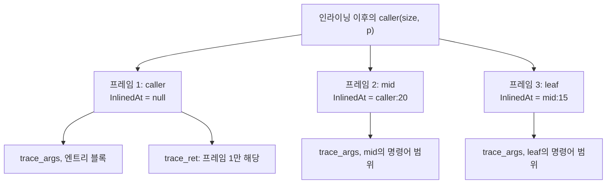

각 프레임은 다음과 같이 동작한다:
1. 자신이 속한 subprogram의 파라미터를 해당 프레임 고유의 arg_idx 번호 체계로 보고한다.
2. 자신의 명령어 범위 내부에서 해당 파라미터를 추적한다.
3. 피호출 함수를 scope로 사용하고 호출 지점을 inlinedAt으로 사용하는 합성 DILocation을 가진다.

마지막 항목은 identity 방식이 동작하게 만드는 핵심이다. trace call은 디버그 라인 테이블에서 해당 프레임의 위치를 상속한다. 따라서 기록된 주소에 addr2line -i를 적용하면 전체 인라인 체인을 복원할 수 있다.
```
프레임 1  ra-1 -> caller:19

프레임 2  ra-1 -> mid:14
                  caller:20        (인라인된 위치)

프레임 3  ra-1 -> leaf:9
                  mid:15           (인라인된 위치)
                  caller:20        (인라인된 위치)
```

하나의 피호출 함수가 서로 다른 두 호출 지점에 인라인되었다면, 두 개의 프레임으로 취급한다. 각 프레임이 서로 다른 인자와 함께 실행되었기 때문이다.

프레임은 각 명령어의 전체 inlinedAt 체인을 따라가며 발견한다. 단순히 한 단계만 검사하지 않는다.

이를 통해 optimizer가 해당 프레임 자체의 코드는 접어 없앴지만, 그 프레임 안에 인라인되었던 코드는 남겨 둔 경우에도 프레임을 복원할 수 있다. 작은 wrapper에서 흔히 볼 수 있는 형태다. 위 테스트 케이스에서는 보고되는 프레임 수가 1개에서 3개로 증가했다.

이처럼 늦은 시점에 pass가 실행되므로 두 가지 제한이 따른다.
1. optimizer가 코드를 완전히 제거한 프레임은 보고하지 않는다. 보고할 주소 범위 자체가 남아 있지 않기 때문이다.
2. 반환값은 살아남은 함수에 대해서만 보고한다. 인라인된 피호출 함수에는 ret 명령어가 없으며, 파라미터를 표현하는 DILocalVariable과 달리 반환값을 기술하는 디버그 레코드도 없다. 이를 인위적으로 만들려면 값을 추측해야 한다.

커널 측에 미치는 결과:
- 작은 피호출 함수를 관측하기 위해 더 이상 -fno-inline이 필요하지 않다.
- CONFIG_KCOV_DATAFLOW_NO_INLINE은 오브젝트별 편의 옵션으로 남아 있다. inline-aware symbolization 없이 일반 kallsyms만으로 레코드를 해석할 수 있게 해주기 때문이다. 또한 이 옵션은 의도적으로 CONFIG_KCOV_DATAFLOW_INSTRUMENT_ALL에 의해 자동 활성화되지 않는다.

8개의 IR 테스트 중 2개는 프레임 동작을 구체적으로 다룬다:
- trace-args-inline-frames.ll: 여전히 코드가 남아 있는 프레임과, 자체 코드는 접혀 없어졌지만 복원 가능한 중간 프레임을 검사한다.
- trace-args-inlined.ll: 코드가 전혀 남아 있지 않은 프레임을 검사한다. 이러한 프레임은 보고되지 않아야 하며, 해당 프레임의 레코드가 바깥 함수의 파라미터로 유출되어서도 안 된다.
- 두 테스트 모두 생성된 IR이 올바른 형식인지도 검증한다. opt는 verifier를 실행하지만 커널 빌드는 그렇지 않기 때문이다.
- 실제로 이 작업에서 발견된 버그도 이 종류였다. 블록의 PHI 노드 사이에 insertion point가 생성되었는데, 커널 빌드에서는 verifier 오류가 발생하지 않았다. 대신 유용한 진단 메시지 없이 kernel/sys.c의 instruction selection 단계에서 크래시가 발생했다.

# 제어 흐름 수준과 값 추적은 서로 독립적이다

func, bb, edge는 제어 흐름 커버리지의 측정 단위를 나타낸다.
- func: 어느 함수가 실행되었는가?
- bb: 어느 basic block이 실행되었는가?
- edge: 어느 제어 흐름 전이가 실행되었는가?

trace-args는 이와 다른 질문에 답한다: 어떤 값이 이 프레임으로 들어왔는가?

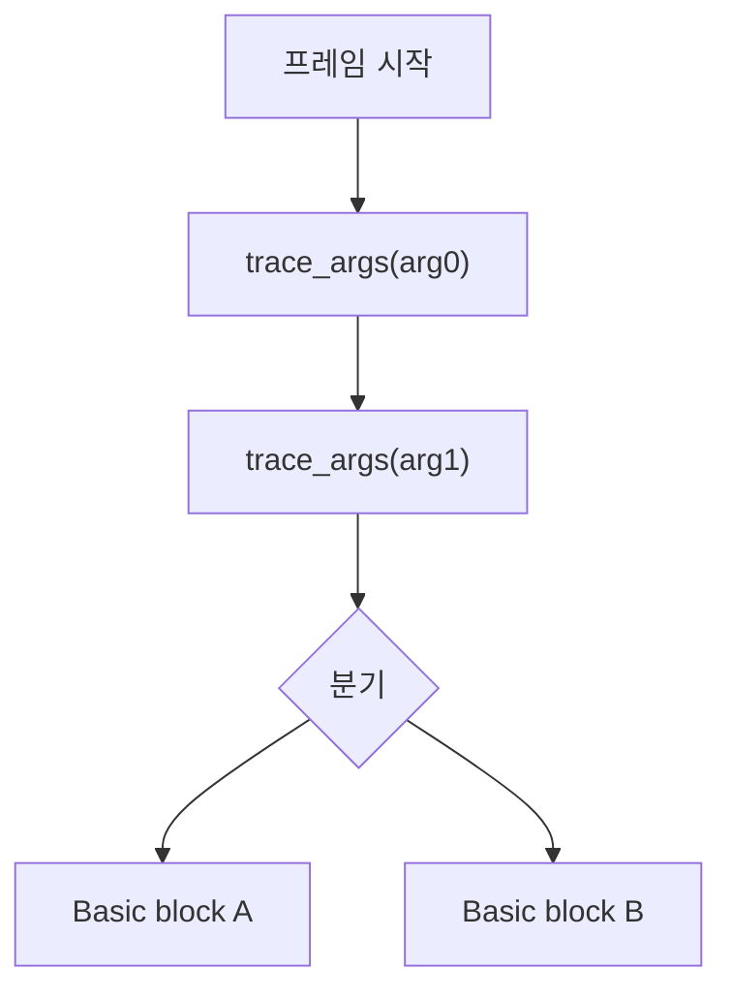

func, bb, edge 중 무엇을 선택하더라도 trace-args가 삽입되는 위치는 바뀌지 않는다.

명시적인 커버리지 수준이 제공되지 않으면 현재 Clang 드라이버는 내부 기본 수준으로 edge를 선택한다.

그러나 이것이 인자 콜백이 모든 edge에 삽입된다는 뜻은 아니며, trace-pc-guard가 자동으로 활성화된다는 뜻도 아니다.

# 인자 추적이 단순하지 않은 이유

소스 코드의 함수 시그니처는 LLVM IR 시그니처와 다를 수 있다.

`struct Big foo(int mode);`

ABI lowering 이후:

```
define void @foo(
    ptr sret(%struct.Big) %result,
    i32 %mode)
```

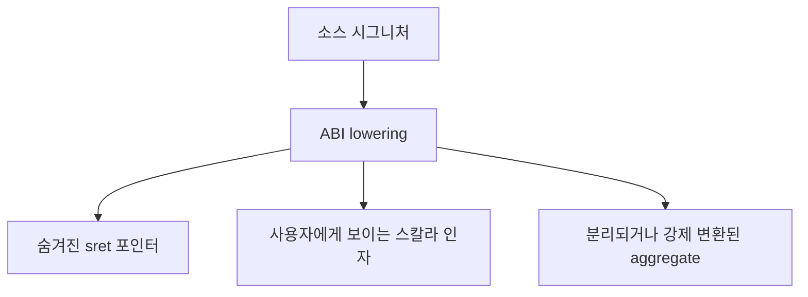

컴파일러는 콜백 identity가 다음 중 무엇을 표현하는지 결정해야 한다.

`소스 수준 파라미터` 또는 `lowering된 IR/ABI 인자`

현재 프로토타입은 사용 가능한 디버그 레코드가 존재하면 소스 수준 파라미터 identity를 복원하려고 한다. 이 동작은 프레임별로 수행된다. 즉, 인라인된 피호출 함수의 파라미터는 호출자의 번호 공간이 아니라 피호출 함수 자체의 번호 공간에서 번호가 매겨진다.

# 설계 원칙: 값은 값으로 유지한다

값은 값으로 유지한다. 이미 메모리에 존재하는 객체만 주소로 보고한다.

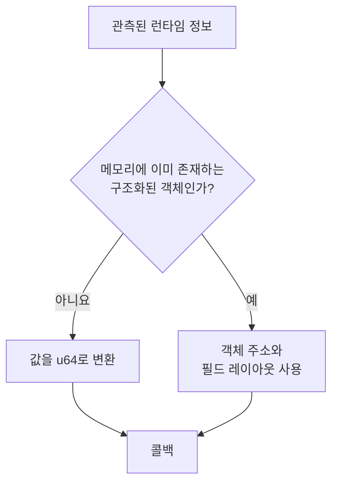

직접 값의 경우:

```
정수          → zero-extend 또는 truncate
포인터        → ptrtoint
부동소수점 값 → 비트 패턴
```

pass는 단순히 값을 보고하기 위한 목적으로 alloca를 새로 만들지 않는다.

# 현재 콜백 ABI

```c
void __sanitizer_cov_trace_args(
    uint32_t arg_idx,
    uint32_t size,
    uint64_t val,
    uint64_t *offsets,
    uint32_t num_fields);

void __sanitizer_cov_trace_ret(
    uint32_t size,
    uint64_t val,
    uint64_t *offsets,
    uint32_t num_fields);
```

pc 인자는 존재하지 않는다.

이전 버전에는 계측된 함수의 주소를 전달하는 pc 인자가 있었다. 하지만 pass가 인라인된 피호출 함수를 보고하기 시작하면서 제거되었다. 인라인된 피호출 함수에는 pc에 넣을 수 있는 독립적인 함수 주소가 없기 때문이다.

다음과 같은 대체 방법도 시도되었지만 채택되지 않았다.

프레임별 descriptor global은 기존 소비자에게 pc가 의미하는 바를 다시 정의해야 한다.
프레임마다 BlockAddress 또는 __sancov_pcs 엔트리를 생성하면 basic block을 고정하게 되어 코드 생성에 영향을 준다.

이는 inliner 이전이 아니라 이후에 pass를 실행하려는 목적을 훼손한다.

현재 identity는 콜백 자체의 반환 주소에서 1을 뺀 값이다.

```c
/* kernel/kcov_dataflow.c */
#define KCOV_DF_CALL_SITE(ret_ip)   ((ret_ip) - 1)

/* compiler-rt/lib/fuzzer/FuzzerTracePC.cpp */
uintptr_t PC =
    reinterpret_cast<uintptr_t>(GET_CALLER_PC()) - 1;
```

1을 빼는 것은 단순한 정리 작업이 아니다.

인라인된 함수의 본문은 제한된 명령어 범위를 가진다. trace call이 해당 범위의 마지막 명령어라면 반환 주소는 범위의 끝을 하나 지난 위치를 가리키며, 그 주소는 다음 프레임에 속할 수 있다.

이 보정이 없으면 레코드가 잘못된 함수를 가리키게 된다.


핵심 해석 규칙:

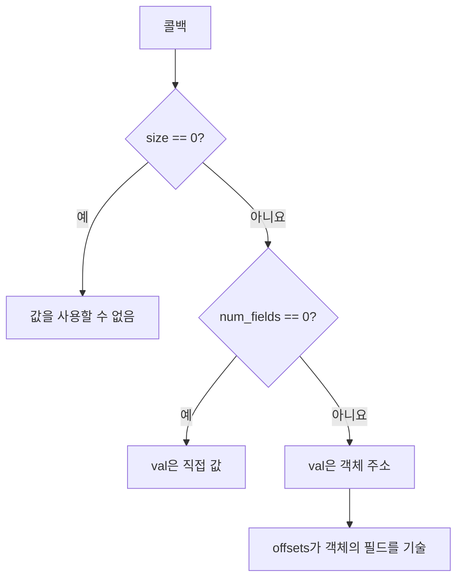

val == 0을 값을 사용할 수 없다는 표시로 사용해서는 안 된다. 0은 유효한 인자 값, 반환값 또는 null 포인터일 수 있기 때문이다.

# 각 콜백 필드의 의미

- arg_idx: 복원할 수 있는 경우, 0부터 시작하는 소스 파라미터 인덱스
  해당 프레임 내부에서 번호가 매겨진다. 따라서 인라인된 피호출 함수의 파라미터 0은 호출자의 파라미터가 아니라 자신에게 속한 파라미터다.

  소스 함수에는 논리적으로 하나의 반환값만 있으므로 trace-ret에는 이 필드가 없다.

- size: 의미 있는 바이트 수
  0은 어떤 값도 보고할 수 없었다는 의미다.

- val
  num_fields == 0: 직접 값
  num_fields > 0: 객체 주소

- offsets: {바이트 오프셋, 바이트 크기} 쌍의 배열

- num_fields: 필드 개수이며, 현재는 직접 값과 객체 주소를 구분하는 discriminator 역할도 함께 수행한다.


필드는 아니지만 계약의 일부인 정보:

- 기록된 위치: 콜백 자체의 반환 주소에서 1을 뺀 값

  inline 정보를 사용해 addr2line -i로 해석하면, 값을 보고한 인라인된 피호출 함수와 해당 함수가 인라인된 전체 체인을 확인할 수 있다.

  일반적인 심볼 테이블만 사용하면 해당 코드가 병합된 함수만 확인할 수 있다. 이는 실제 정보 해상도의 손실이며, identity 변경이 소비자에게 요구하는 비용이다.

  이 값은 여전히 동적인 함수 호출 인스턴스의 identity는 아니다. 예를 들어 두 번의 재귀 호출은 서로 구분할 수 없다.

# 구조화된 반환값도 관측할 수 있다

trace-ret은 주요한 두 가지 ABI 반환 전략을 모두 지원한다.

sret을 이용한 간접 반환:
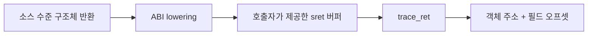

표현 예시:
```
size       = sizeof(struct Big)
val        = sret 버퍼 주소
num_fields = 필드 개수
offsets    = 구조체 레이아웃
```

레지스터로 반환되는 aggregate:
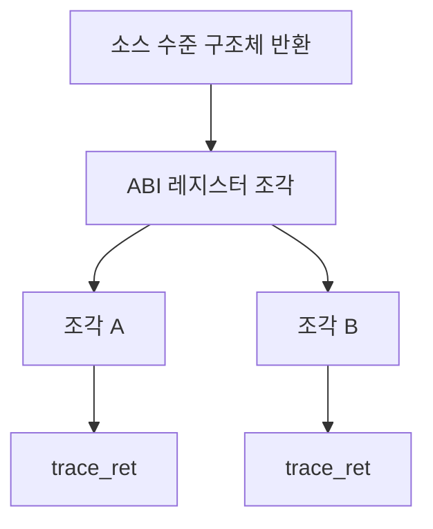

각 값은 관측할 수 있지만, 현재 콜백에는 다음 정보가 포함되지 않는다.
- piece 인덱스
- 소스 오프셋
- 전체 piece 개수
- 소스 필드 identity

구조화된 반환값 지원과 레지스터 조각 동작은 LLVM 패치에서 명시적으로 테스트된다.

# 디버그 정보가 소스 수준의 관점을 정의한다

현재 소스 수준 인자 매핑은 디버그 레코드를 사용한다.

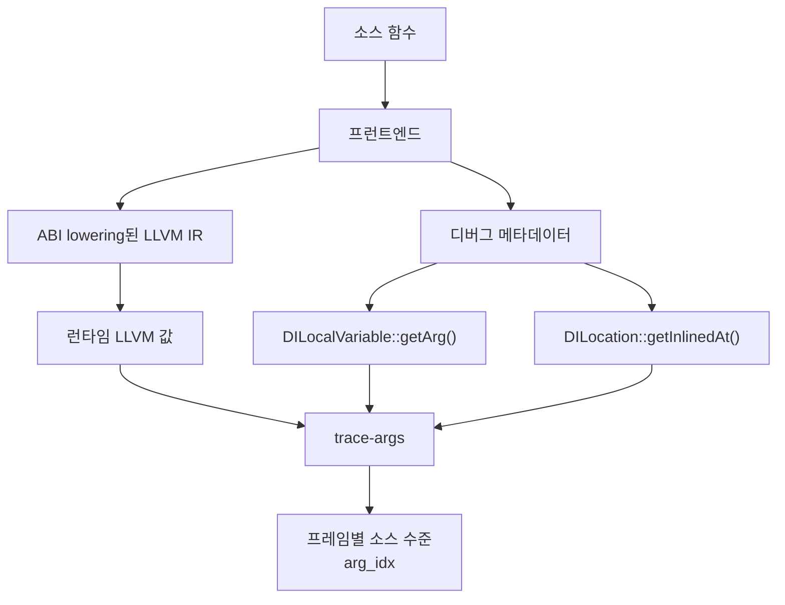

계측은 -g 없이도 사용할 수 있지만, 추상화 수준이 달라진다.

디버그 정보가 없더라도 trace-args와 trace-ret은 메모리를 새로 만들지 않고 구체적인 LLVM IR 값을 관측한다. 그러나 일반적으로 필드 테이블은 사용할 수 없다.

-g 없이 빌드하면 디버그 위치도 없으므로 인라인된 프레임을 발견할 수 없다.

따라서 함수 자신의 본문에 해당하는 하나의 프레임만 존재하며, IR 인자 목록의 위치를 기준으로 보고한다. 이는 특별히 추가된 예외 처리가 아니다. 동일한 반복 처리 과정에서 자연스럽게 발생하는 결과다. 따라서 프레임 지원이 추가된 이후에도 디버그 정보가 없는 경우의 동작은 변경되지 않았다.

디버그 정보가 없는 경우 ABI 수준 의미론으로 fallback하는 것은 불완전한 소스 수준 복원을 시도하는 것보다 일반적으로 더 안전하다. 다만 이러한 ABI 수준 의미론은 명시적으로 문서화하고 테스트해야 한다.

프레임 지원은 기존 답을 바꾸는 것이 아니라, 디버그 정보의 중요성을 더 높인다.

이제 디버그 메타데이터는 arg_idx를 계산하는 수단일 뿐만 아니라 인라인된 피호출 함수 자체를 발견하는 수단이기도 하다. 따라서 빌드에서 어떤 함수가 관측되는지는 최적화 이후 디버그 위치가 얼마나 잘 보존되었는지에 따라 달라질 수 있다.

반론은 이 정보를 얻을 수 있는 다른 방법이 없다는 것이다. inliner 실행 이후에는 디버그 메타데이터만이 해당 피호출 함수가 존재했다는 사실을 기록하고 있다.


# 우리가 합의해야 할 사항

## Linux 에서의 지원

1. 새로운 KCOV 모드로 만들어야 하는가? 별도의 KCOV-dataflow 기능으로 유지해야 하는가?

2. 더 일반적인 값 관측 인프라로 만들어야 하는가?

## 컴파일러 콜백 ABI

1. 추상화 수준
  소스 수준 파라미터 값을 제공해야 하는가?
  ABI/IR 수준 값을 제공해야 하는가?
  사용 가능한 디버그 메타데이터를 런타임 계측 의미론의 입력으로 사용하는 것이 허용 가능한가?
  이제 디버그 메타데이터는 arg_idx뿐만 아니라 어떤 함수가 관측되는지도 결정한다.

2. 콜백 표현
  num_fields가 필드 개수와 값/주소 구분자 역할을 동시에 수행해야 하는가?

3. uint64_t가 값의 너비로 충분한가? 64비트보다 넓은 값은 어떻게 표현해야 하는가?

4. Identity
  반환 주소를 계측 콜백의 identity로 사용하는 것이 올바른가?
  이 방식은 인라인된 프레임을 보고할 수 있게 하며 trace-cmp의 동작과도 일치한다. 그러나 소비자가 주소를 해석해야 한다.
  더 나아가 주소를 제대로 해석하려면 inline-aware symbolization이 필요하다. ABI가 소비자에게 이를 요구해도 되는가?

## 커널 mmap UAPI

1. 8비트 size와 arg_idx 필드가 충분한가?

2. 구조화된 RET 값은 어떻게 표현해야 하는가?

3. 호출 또는 반환 인스턴스에 명시적인 식별자가 있어야 하는가?

4. 손실 보고
  현재 dropped-record counter가 없다. 따라서 버퍼가 가득 찬 상태와 단순히 캡처가 짧게 끝난 상태를 구분할 수 없다.
  인라인된 프레임을 보고하면 레코드 생성률이 증가하므로 이는 더 이상 이론적인 문제가 아니다.
  selftest의 한 trigger는 1M-word 버퍼를 가득 채웠고, 누락된 마지막 부분은 명확한 진단 메시지가 아니라 네 개의 assertion 실패로 나타났다.
  또한 binderfs selftest는 자신의 버퍼를 가득 채우기까지 세 word가 부족한 상태로 실행되면서도 현재는 성공한 것으로 처리된다.

## 런타임 정책

1. 런타임 메모리 접근
  타입과 레이아웃 메타데이터만으로 객체를 읽을 충분한 근거가 되는가?

# 원하는 결과

현재 프로토타입은 이미 end-to-end 경로가 동작한다는 것을 보여준다.

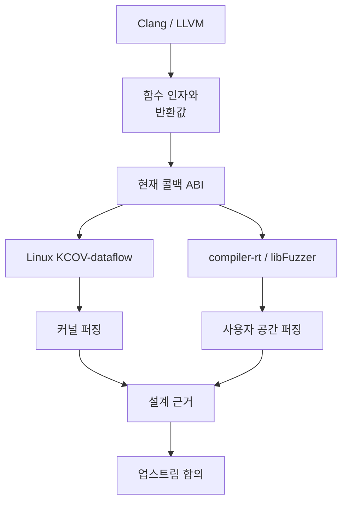